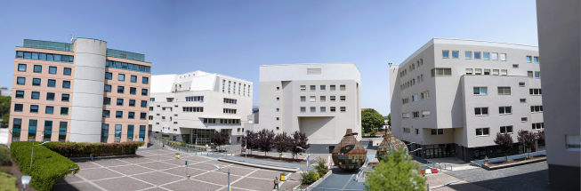
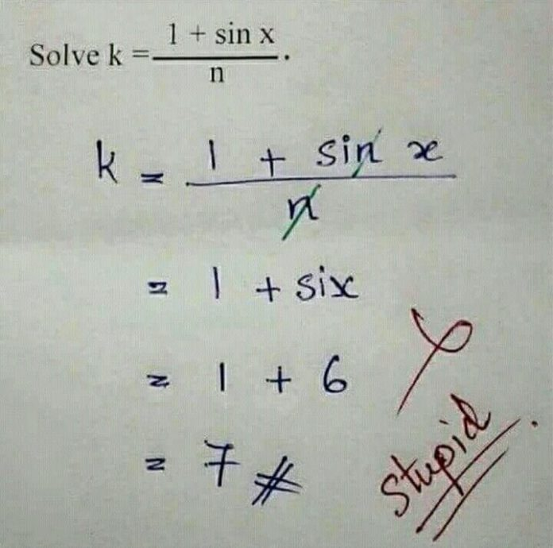

```{r setup, include=FALSE}
knitr::opts_chunk$set(echo = FALSE,
                      message = FALSE,
                      warning = FALSE,
                      fig.align = "center",
                      out.width = "100%")
```

```{r packages}
devtools::load_all()
library(tidyverse)
library(kableExtra)
library(patchwork)
lectures <- readRDS("../../objects/lectures.rds")
```

## About me

- I'm a **post-doc researcher** at the Department of Developmental Psychology and Socialization
- I did a **PhD in Experimental Psychology** studying the unconscious working memory processing
- I work with Professor Gianmarco Altoè on data analysis in Psychology, especially **meta-analysis**

## Office hours

I do not have official office hours but we can schedule an appointment. you can write me at **[filippo.gambarota@unipd.it](mailto::filippo.gambarota@unipd.it)**:

- my office is the 027, first floor Psico 1 building (pink building)
- we can also schedule on Zoom

```{r, out.width="70%"}

```

## Lectures

We are going to spend the following hours together:

```{r, echo = FALSE}
lectures |> 
    mytab() |> 
    kable_styling(latex_options = "HOLD_position")
```

## Materials

The slides will be structured intermixing:

- R code
- Theory and Formulas (not a lot :) )
- Plots (a lot!)
- Examples and exercises

## R Materials

All the slides and extra materials are available on Moodle. During the course and for the exercises we will use some **custom functions** that I wrote for the course. To download and use the function you can download the `utils-glm.R` file from Moodle or from here **`r download_link("https://github.com/stat-teaching/SMDA-2023/blob/master/R/utils-glm.R", print_url = TRUE)`**

## Materials

- slides with the `r format(color("\\#extra", "red"), "code")` tag are very specific but useful topics that will be eventually covered but are not part of the core course/exam

## R

The course materials are created using R (4.3.0). To organize the materials I used **R Projects**, a feature available with R Studio. I highly suggest you to use R Projects that significantly improves your workflow. A brief tutorial is available here [https://r4ds.had.co.nz/workflow-projects.html](https://r4ds.had.co.nz/workflow-projects.html).

## R code

I mainly use R for my daily work but a deep understanding of R is not necessary. 

Slides are created with R Markdown (`.rmd` files) and distributed in `pdf` and all source scripts are available.

I wrote several custom functions that are used in the slide and maybe during the exercizes.

## R Packages

We will use, directly or indirectly (for custom functions), several R packages. You can easily install all packages using:

```{r, eval = FALSE, echo = TRUE}
pksg <- c("effects", "tidyverse", "MASS", 
          "broom", "reshape2", "ggeffects",
          "performance", "see", "car", "devtools")
install.packages(pkgs)
```

## Pipes

Sometimes in my code you will see a symbol like this `|>`, this is called **pipe**. Sometimes it is also written as `%>%` that is a different pipe coming from the `magrittr` package. The pipe is a very simple way to write R code when you need to apply multiple functions in succession. Practically, the pipe apply a function to an element, for example:

```{r, eval = FALSE, echo = TRUE}
# these two are the same
mean(x)

# to x apply the mean function
x |> mean()
```

## Pipes

Beyond this silly example, when we need to use multiple nested functions the pipe makes the code more readable:

```{r, echo = TRUE}
x <- runif(10)

# without pipe
exp(min(round(x, 2)))

# with pipe
x |> 
    round(2) |> 
    min() |> 
    exp()
```

## Theory and Formulas

I tried to reduce the amount of formulas. I prefer to make practical examples and showing the R code.

The probability of making an error or typo is close to 1 (Shepard, 2023), if you find something strange raise the hand or write me an email :)

```{r out.width="30%"}

```

`r note("Source: https://www.splashlearn.com/blog/funny-school-memes-every-student-will-love/")`

## Examples and exercises

I tried to make practical examples whenever possible and relevant. Furthermore we will see some exercises and case studies.

## Rules of the game

1. **Participate!** If you have questions, doubts, comments, etc. please ask
2. If something is **not clear or is discordant** with other information from previous courses, tell me.
3. **Participate!**
4. Try do to **exercises and case studies**
5. **Participate!**
6. If you can, **bring your laptop with R**

## Prepare the course folder `#optional`

\small
- Install the packages of slide *R Packages*
- Download and extract the **template course folder** from here **[github.com/stat-teaching/SMDA-2023](https://github.com/stat-teaching/SMDA-2023/archive/refs/heads/template.zip)**.
- Open the `SMDA-2023.Rproj` file
- Use the command `devtools::load_all()` will load each function within the `R/` folder. You can consider this folder as an R Package
- Run the `init_project()` function and the relevant folders and files will be created
- From now, you can open the `SMDA-2023.Rproj` and organize data and exercises within that folder

## Final note

This is my first teaching experience with this course. Suggestions and critique are welcome.

```{r, out.width="50%"}

```


