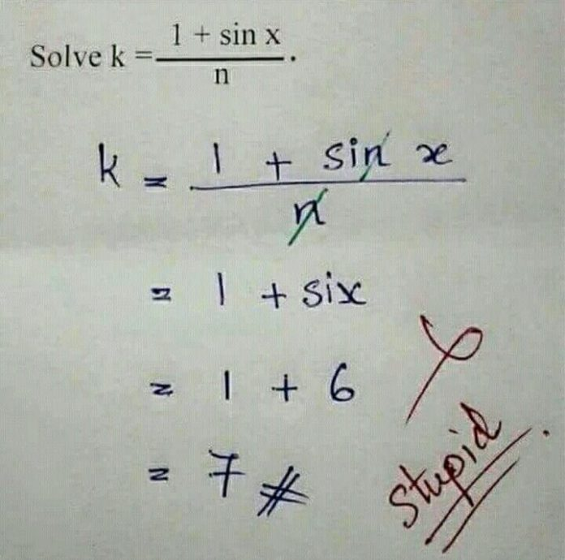

```{r setup, include=FALSE}
knitr::opts_chunk$set(echo = FALSE,
                      message = FALSE,
                      warning = FALSE,
                      fig.align = "center",
                      out.width = "100%")
```

```{r packages}
devtools::load_all()
library(tidyverse)
library(kableExtra)
library(patchwork)
```

## About me

- I'm a post-doc researcher at the Department of Developmental Psychology and Socialization
- I did a PhD in Experimental Psychology studying the unconscious working memory processing
- I work with Professor Gianmarco Altoè on data analysis in Psychology, especially meta-analysis

## Office hours

I do not have official office hours but we can schedule an appointment. you can write me at **[filippo.gambarota@unipd.it](mailto::filippo.gambarota@unipd.it)**:

- my office is the 027, first floor Psico1 building (pink building)
- we can also schedule on Zoom

## Materials

The slides will be structured intermixing:

- R code
- Theory and Formulas (not a lot :) )
- Plots (a lot!)
- Examples and exercises

## Materials

- slides with the `r format(color("\\#extra", "red"), "code")` tag are very specific but useful topics that will be eventually covered but are not part of the core course/exam

## R code

I mainly use R for my daily work but a deep understanding of R is not necessary. 

Slides are created with R Markdown (`.rmd` files) and distributed in `pdf` and all source scripts are available.

I wrote several custom functions that are used in the slide and maybe during the exercizes.

## Theory and Formulas

I tried to reduce the amount of formulas. I prefer to make practical examples and showing the R code.

The probability of making an error or typo is close to 1 (Shepard, 2023), if you find something strange raise the hand or write me an email :)

```{r out.width="30%"}

```

`r note("Source: https://www.splashlearn.com/blog/funny-school-memes-every-student-will-love/")`

## Examples and exercises

I tried to make practical examples whenever possible and relevant. Furthermore we will see some exercises and case studies.

## Rules of the game

1. **Participate!** If you have questions, doubts, comments, etc. please ask
2. If something is **not clear or is discordant** with other information from previous courses, tell me.
3. **Participate!**
4. Try do to **exercises and case studies**
5. **Participate!**
6. If you can, **bring your laptop with R**

## Final note

This is my first teaching experience with this course. Suggestions and critique are welcome.


