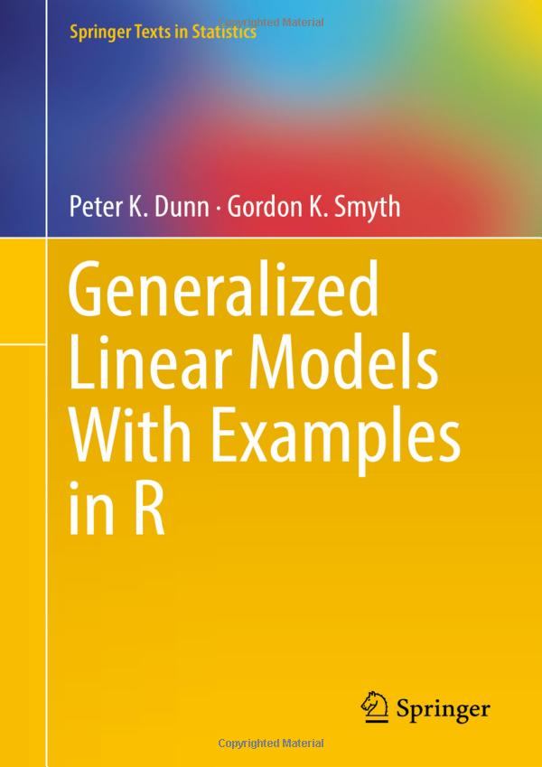

```{r setup, include=FALSE}
knitr::opts_chunk$set(echo = TRUE,
                      eval = TRUE,
                      size = "tiny",
                      message = FALSE,
                      warning = FALSE,
                      fig.align = "center",
                      out.width = "100%")

def.chunk.hook  <- knitr::knit_hooks$get("chunk")
knitr::knit_hooks$set(chunk = function(x, options) {
  x <- def.chunk.hook(x, options)
  ifelse(options$size != "normalsize", paste0("\n \\", options$size,"\n\n", x, "\n\n \\normalsize"), x)
})
```

```{r packages, include=FALSE}
devtools::load_all()
library(tidyverse)
library(kableExtra)
library(patchwork)
library(here)
```

```{r functions, include = FALSE}
funs <- get_funs(here("R", "utils.R"))
```

## Outline

<!-- \tableofcontents[hideallsubsections] -->
\scriptsize
\tableofcontents

# Beyond the Gaussian distribution

## Quick recap about Gaussian distribution

$$
f(x) = \frac{1}{\sigma\sqrt{2\pi}} e^{-\frac{1}{2}(\frac{x - \mu}{\sigma})^2}
$$

Were $\mu$ is the **mean** and $\sigma$ is the **standard deviation**

## Quick recap about Gaussian distribution

```{r, echo = FALSE}
ggnorm(0, 1) + 
    mytheme() +
    ggtitle(latex2exp::TeX("$\\mu = 0$, $\\sigma = 1$"))
```

\begin{center}
But not always gaussian-like variables!
\end{center}

## Reaction times

Measuring reaction times during a cognitive task. Non-negative and proably skewed data.

```{r, echo = FALSE}
dat <- data.frame(
    x = rgamma(1e5, 9, scale = 0.5)*100
) 

dat |> 
    ggplot(aes(x = x)) +
    geom_histogram(fill = "lightblue",
                   color = "black") +
    xlab("Reaction Times (ms)") +
    ylab("Count") +
    mytheme()
```

## Binary outcomes

Counting the number of people passing the exam out of the total. Discrete and non-negative. A series of binary (i.e., *bernoulli*) experiments.

```{r, echo = FALSE}
dat <- data.frame(x = rbinom(1e5, 10, 0.7))

dat |> 
    ggplot(aes(x = factor(x))) +
    geom_bar(fill = "lightblue",
             color = "black") +
    xlab("Number of success out of 10 trials") +
    ylab("Count") +
    mytheme()
```

## Binary outcomes

```{r, echo = FALSE}
dat <- data.frame(y = c(70, 30), x = c("Passed", "Failed"))

dat |> 
    ggplot(aes(x = x, y = y)) +
    geom_col(color = "black",
             fill = "lightblue") +
    ylab("Count") +
    mytheme() +
    theme(axis.title.x = element_blank()) +
    ggtitle("Statistics Final Exam (n = 100)")
```

## Counts

Counting the number of new patients per week. Discrete and non-negative values.

```{r, echo = FALSE}
dat <- data.frame(x = rpois(1e5, 15))

dat |> 
    ggplot(aes(x = x)) +
    geom_histogram(binwidth = 2,
                   color = "black",
                   fill = "lightblue") +
    xlab("Number of new patients per week") +
    ylab("Count") +
    mytheme()
```

## Should we use a linear model for these variables?

```{r, echo = FALSE}
# y = number of exercises solved in 1 semester
# x = percentage of attended lectures

n <- 30
x <- rep(0:10, each = n)
b0 <- 0.01
b1 <- 0.8
y <- rbinom(length(x), 1, plogis(qlogis(b0) + b1*x))

dat <- data.frame(x, y)

dat |> 
    ggplot(aes(x = x, y = y)) +
    geom_hline(yintercept = 0, linetype = "dashed", col = "red") +
    geom_point(size = 3,
               alpha = 0.5,
               position = position_jitter(height = 0.03)) +
    geom_smooth(method = "lm", 
                se = F) +
    mytheme() +
    scale_x_continuous(breaks = 0:10) +
    xlab("Questions difficulty") +
    ylab("Probability of passing the exam")
```

## Should we use a linear model for these variables?

```{r, echo = FALSE}
# y = number of exercises solved in 1 semester
# x = percentage of attended lectures

n <- 30
x <- runif(n, 0, 1)
b0 <- 0
b1 <- 4
y <- rpois(n, exp(b0 + b1*x))

dat <- data.frame(x, y)

dat |> 
    ggplot(aes(x = x*100, y = y)) +
    geom_hline(yintercept = 0, linetype = "dashed", col = "red") +
    geom_point(size = 3) +
    geom_smooth(method = "lm", 
                se = F) +
    mytheme() +
    xlab("Percetage of attended lectures") +
    ylab("Solved exercises")
```

## Should we use a linear model for these variables?

```{r, echo = FALSE}
fit <- lm(y ~ x, data = dat)

dfit <- data.frame(
    fitted = fitted(fit),
    residuals = residuals(fit)
)

qqn <- dfit |> 
    ggplot(aes(sample = residuals)) + 
    stat_qq() + 
    stat_qq_line() +
    xlab("Theoretical Quantiles") +
    ylab("Residuals") +
    mytheme()

res_fit <- dfit |> 
    ggplot(aes(x = fitted, y = residuals)) +
    geom_point() +
    mytheme() +
    ylab("Residuals") +
    xlab("Fitted")
qqn + res_fit
```

## A new class of models

- We need that our model take into account the **features of our response variable**
- We need a model that, **with appropriate transformation**, keep **properties of standard linear models**
- We need a model that is **closer to the true data generation process**

\begin{center}
Let's switch to Generalized Linear Models!
\end{center}

# Generalized Linear Models

## Main references

For a basic and well written introduction about GLM, especially the Binomial GLM

- Chapters: 3 (intro GLMs), 4-5 (Binomial Logistic Regression)

```{r}
knitr::include_graphics("img/agresti2019-intro-to-categorical.jpg")
```
::::
:::::: columns
:::: column

For a detailed introduction about GLMs

- Chapters: 1 (intro), 4 (GLM fitting), 5 (GLM for binary data)

```{r}
knitr::include_graphics("img/agresti2015-foundations-lm-glm.jpg")
```

::::
:::: column

## Main references

Great resource for interpreting Binomial GLM parameters:

- Chapters: 13-14 (Binomial Logistic GLM), 15 (Poisson and others GLMs)
```{r}
knitr::include_graphics("img/gelman2020-reg-and-other-stories.jpg")
```
::::
:::

::: columns
:::: column

Detailed GLMs book. Very useful especially for the diagnostic part:

- Chapters: 8 (intro), 9 (Binomial GLM), 10 (Poisson GLM and overdispersion)

```{r}

```

::::
:::: column

## General idea

- models that assume distributions other than the normal distributions
- models that considers non-linear relationships

<!-- TODO add something else -->

## Recipe for a GLM

- **Random Component**
- **Systematic Component**
- **Link Function**

## Random Component

The **random component** of a GLM identify the response variable $Y$ and the appropriate probability distribution. For example for a numerical and continous variable we could use a Normal distribution (i.e., a standard linear model). For a discrete variable representing counts of events we could use a Poisson distribution.

## Systematic Component

The **systematic component** or *linear predictor* of a GLM is the combination of explanatory variables i.e. $\beta_0 + \beta_1x_1 + ... + \beta_px_p$.

## Link Function

The **link function** $g(\mu)$ is the function that connects the expected value (i.e., the mean $\mu$) of the probability distribution (i.e., the random component) with the *linear combination* of predictors $g(\mu) = \beta_0 + \beta_1x_1 + ... + \beta_px_p$

The simplest **link function** is the **identity link** where $g(\mu) = \mu$ and correspond to the classic linear model. In fact, the linear regression is just a GLM with a **Gaussian random component** and the **identity** link function.

There are multiple **random components** and **link functions** for example with a 0/1 binary variable the usual choice is using a **Binomial** random component and the **logit** link function.

# Relevant distributions

## Binomial distribution

The probability of having $k$ success (e.g., 0, 1, 2, etc.) out of $n$ trials with a probability of success $p$ is:

$$
f(n, k, p) = Pr(X = k) = \binom{n}{k} p^k(1 - p)^{n - k}
$$

The $np$ is the mean of the binomial distribution and $np(1 - p)$ is the variance.

## Bernoulli distribution

The **binomial** distribution is just a repetition of $k$ **Bernoulli** trials. A single Bernoulli trial is:

\begin{align*}
f(x, p) = p^x (1 - p)^{1 - x} \\
x \in \{0, 1\}
\end{align*}

The mean is $p$ and the variance is $p(1 - p)$

## Bernoulli and Binomial

The simplest situation for a Bernoulli trials is a coin flip. In R:

::: columns
:::: column

```{r}
n <- 1
p <- 0.7
rbinom(1, n, p) # a single bernoulli trial

n <- 10
rbinom(1, 10, p) # n bernoulli trials
```

::::
:::: column
```{r, echo = FALSE}
n <- 30
p <- 0.7
dat <- data.frame(k = 0:n)
dat$y <- dbinom(dat$k, n, p)

dat |> 
    ggplot(aes(x = k, y = y)) +
    geom_point() +
    geom_segment(aes(x = k, xend = k, y = 0, yend = y)) +
    mytheme() +
    ylab("dbinom(x, n, p)") +
    ggtitle(latex2exp::TeX("$n = 30$, $p = 0.7$"))

```
::::
:::

## Poisson distribution

The number of events $k$ during a fixed time interval (e.g., number of new user on a website in 1 week) is:

\begin{align*}
f(j,\lambda) = Pr(X = k) = \frac{\lambda^k e^{-\lambda}}{k!}
\end{align*}

## Poisson distribution

```{r, echo = FALSE}
lambda <- 10
dat <- data.frame(x = 0:100)
dat$y <- dpois(dat$x, lambda)

dat |> 
    filter(x < 30) |> 
    ggplot(aes(x = x, y = y)) +
    geom_line() +
    geom_point(size = 4, shape = 21, stroke = 3, color = "white",
               fill = "black") +
    mytheme() +
    ylab(latex2exp::TeX("dpois(x, $\\lambda$)")) +
    ggtitle(latex2exp::TeX("$\\lambda = 10$"))
```

The mean and also the variance is $\lambda$.

# Data simulation *[EXTRA]*

## Data simulation *[EXTRA]*

- During the course we will try to simulate some data. Simulating data is an amazing education tool to understand a statistical model.
- By simulating from a **generative model** we are doing **Monte Carlo Simulations** [@Gentle2009-cj]

## Data simulation *[EXTRA]*

::: columns

:::: column
```{r, size = "tiny"}
n <- 1e5 # number of experiments
nt <- 100 # number of subjects
p <- 0.7 # probability of success
nc <- rbinom(n, nt, p)
```

```{r, echo = FALSE}
hist(nc/nt)
```
::::

:::: column
```{r, size = "tiny"}
n <- 1e5 # number of subjects
lambda <- 30 # mean/variance
y <- rpois(n, lambda)
```

```{r, echo = FALSE}
hist(y)
```
::::

:::

# Binomial GLM

## Example: Passing the exam

We want to measure the impact of **watching tv-shows** on the probability of **passing the statistics exam**.

- `exam`: **passing the exam** (1 = "passed", 0 = "failed")
- `tv_shows`: **watching tv-shows regularly** (1 = "yes", 0 = "no")

```{r, echo = FALSE}
n <- 100
n_watching <- n/2 # just for simplicity
p_pass_yes <- 0.7
p_pass_no <- 0.3

dat <- data.frame(
    tv_shows = rep(c(1, 0), each = n_watching)
)

b0 <- 0.3 # P(passing|not watching)
b1 <- 3.5 # odds ratio between watching and not watching

# pn_from_or(0.3, 3.5) # P(passing|watching)

dat$exam <- rbinom(n, 1, plogis(qlogis(b0) + log(b1)*dat$tv_shows))
fit <- glm(exam ~ tv_shows, data = dat, family = binomial(link = "logit"))
```

```{r}
head(dat)
```

## Example: Passing the exam

We can create the **contingency table**

```{r}
xtabs(~exam + tv_shows, data = dat) |> 
    addmargins()
```

## Example: Passing the exam

Each cell probability $\pi_{ij}$ is computed as $\pi_{ij}/n$

```{r}
(xtabs(~exam + tv_shows, data = dat)/n) |> 
    addmargins()
```

## Example: Passing the exam - Odds

The most common way to analyze a 2x2 contingency table is using the **odds ratio** (OR). Firsly let's define *the odds of success* as:

$$
odds = \frac{\pi}{1 - \pi} \;\;\;\;
\pi = \frac{odds}{odds + 1}
$$

- the **odds** are non-negative, ranging between 0 and $+\infty$
- an **odds** of e.g. 3 means that we expect 3 *success* for each *failure*

## Example: Passing the exam - Odds

For the `exam` example:

```{r}
odds <- function(p) p / (1 - p)
p11 <- mean(with(dat, exam[tv_shows == 1])) # passing exam | tv_shows
odds(p11)
```

## Example: Passing the exam - Odds Ratio

The OR is a ratio of odds:

$$
OR = \frac{\frac{\pi_1}{1 - \pi_1}}{\frac{\pi_2}{1 - \pi_2}}
$$

- OR ranges between 0 and $+\infty$. When $OR = 1$ the odds for the two conditions are equal
- An e.g. $OR = 3$ means that being in the condition at the numerator increase 3 times the odds of success

## Example: Passing the exam - Odds Ratio

```{r}
odds_ratio <- function(p1, p2) odds(p1) / odds(p2)
p11 <- mean(with(dat, exam[tv_shows == 1])) # passing exam | tv_shows
p10 <- mean(with(dat, exam[tv_shows == 0])) # passing exam | not tv_shows
odds_ratio(p11, p10)
```

## Why using these measure?

The odds have an interesting property when taking the logarithm. We can express a probability $\pi$ using a scale ranging $[-\infty, +\infty]$

```{r, echo = FALSE}
p1 <- seq(0, 1, 0.001)
p2 <- seq(1, 0, -0.001)

ord <- data.frame(
    p1, p2
)

ord$or <- odds_ratio(ord$p1, ord$p2)

ord |> 
    ggplot(aes(x = p1, y = log(or))) +
    geom_hline(yintercept = 0, 
               linetype = "dashed",
               col = "firebrick2",
               linewidth = 0.5) +
    geom_line(linewidth = 1) +
    mytheme() +
    ylab(latex2exp::TeX("$log(\\frac{\\pi}{1 - \\pi})$")) +
    scale_x_continuous(
        latex2exp::TeX("$\\pi$"),
        sec.axis = dup_axis(
            trans = .~rev(.),
            name = latex2exp::TeX("$1 - \\pi$")
        )
    )
```

# Binomial GLM

## Binomial GLM

- The **random component** of a Binomial GLM the binomial distribution with parameter $\pi$
- The **systematic component** is a linear combination of predictors and coefficients $\boldsymbol{\beta X}$
- The **link function** is a function that map probabilities into the $[-\infty, +\infty]$ range.

## Binomial GLM - Logit Link

The **logit** link is the most common link function when using a binomial GLM:

$$
log \left(\frac{\pi}{1 - \pi}\right) = \beta_0 + \beta_{1}X_{1} + ...\beta_pX_p  
$$

The inverse of the **logit** maps again the probability into the $[0, 1]$ range:

$$
\pi = \frac{e^{\beta_0 + \beta_{1}X_{1} + ...\beta_pX_p}}{1 + e^{\beta_0 + \beta_{1}X_{1} + ...\beta_pX_p}}  
$$

## Binomial GLM - Logit Link

Thus with a single numerical predictor $x$ the relationship between $x$ and $\pi$ in non-linear on the probability scale but linear on the logit scale.

```{r, echo = FALSE}
x <- seq(0, 1, 0.001)
p <- plogis(qlogis(0.01) + 8*x)

dat <- data.frame(x, p)
dat$lp <- log(odds(dat$p))

dat |> 
    pivot_longer(c(p, lp)) |> 
    mutate(name = factor(name, 
                         labels = c(latex2exp::TeX("$log \\left(\\frac{\\pi}{1-\\pi}\\right)$"),
                                    latex2exp::TeX("$\\pi$")))) |> 
    ggplot(aes(x = x*100, y = value)) +
    facet_wrap(~name, scales = "free",
               labeller = label_parsed) +
    geom_line() +
    xlab(latex2exp::TeX("$X_1$")) +
    mytheme() +
    theme(axis.title.y = element_blank())
```

## Binomial GLM - Logit Link

The problem is that effects are non-linear, thus is more difficult to interpret and report model results

```{r, echo = FALSE}
x <- runif(10000, 0, 1)
p <- plogis(qlogis(0.01) + 8*x)
linpred <- qlogis(p)
y <- rbinom(length(x), 1, p)

dat <- data.frame(
    y = y,
    x = x,
    p = p,
    lp = linpred
)

fp <- function(x) {
    qlogis(0.01) + 8 * x
}

pp <- c(0.5, 0.6, 0.7, 0.8)

plot_logit <- ggplot() +
    stat_function(data = data.frame(x = c(0,1)), 
                  aes(x),
                  fun = fp) +
    # points
    geom_point(aes(x = pp, y = fp(pp))) +
    geom_point(aes(x = c(0, 0, 0, 0), y = fp(pp))) + 
    geom_point(aes(x = pp, y = c(-5, -5, -5, -5))) +
    # segments
    geom_segment(aes(x = pp, y = c(-5, -5, -5, -5),
                     xend = pp, yend = fp(pp)),
                 linetype = "dashed",
                 linewidth = 0.3) +
    geom_segment(aes(x = pp, y = c(-5, -5, -5, -5),
                     xend = pp, yend = fp(pp)),
                 linetype = "dashed",
                 linewidth = 0.3) +
    geom_segment(aes(x = c(0,0,0,0), y = fp(pp),
                     xend = pp, yend = fp(pp)),
                 linetype = "dashed",
                 linewidth = 0.3) +
    mytheme() +
    xlab(latex2exp::TeX("$X_1$")) +
    ylab(latex2exp::TeX("$logit(\\pi)$"))

plot_invlogit <- ggplot() +
    stat_function(data = data.frame(x = c(0,1)), 
                  aes(x),
                  fun = function(x) plogis(fp(x))) +
    # points
    geom_point(aes(x = pp, y = plogis(fp(pp)))) +
    geom_point(aes(x = pp, y = c(0, 0, 0, 0))) +
    geom_point(aes(x = c(0, 0, 0, 0), y = plogis(fp(pp)))) +
    # segments
    geom_segment(aes(x = pp, y = c(0, 0, 0, 0),
                     xend = pp, yend = plogis(fp(pp))),
                 linetype = "dashed",
                 linewidth = 0.3) +
    geom_segment(aes(x = pp, y = c(0, 0, 0, 0),
                     xend = pp, yend = plogis(fp(pp))),
                 linetype = "dashed",
                 linewidth = 0.3) +
    geom_segment(aes(x = c(0, 0, 0, 0), y = plogis(fp(pp)),
                     xend = pp, yend = plogis(fp(pp))),
                 linetype = "dashed",
                 linewidth = 0.3) +
    mytheme() +
    xlab(latex2exp::TeX("$X_1$")) +
    ylab(latex2exp::TeX("$logit^{-1}(\\pi)$"))

plot_logit | plot_invlogit
```

## Binomial GLM - Model fitting

<!-- TODO add here -->

ciao

## Binomial GLM - Model fitting in R

```{r}

```

## Binomial GLM - Model fitting in R

We can model the contingency table presented before. We put data in **binary form**:

```{r, echo = FALSE}
n <- 100
n_watching <- n/2 # just for simplicity
p_pass_yes <- 0.7
p_pass_no <- 0.3

dat <- data.frame(
    tv_shows = rep(c(1, 0), each = n_watching)
)

b0 <- 0.3 # P(passing|not watching)
b1 <- 3.5 # odds ratio between watching and not watching

# pn_from_or(0.3, 3.5) # P(passing|watching)

dat$exam <- rbinom(n, 1, plogis(qlogis(b0) + log(b1)*dat$tv_shows))
```

```{r}
dat |> 
    trim_df()
# TODO add table here
```


## Binomial GLM - Intercept only model

Let's start from the simplest model where the systematic part is only the intercept:

```{r}
fit0 <- glm(exam ~ 1, data = dat, family = binomial(link = "logit"))
summary(fit0)
```

## Binomial GLM - Intercept only model

When fitting an intercept-only model, the parameter is the average value of the `y` variable. In our case, we are fitting a model $logis(\pi) = \beta_0$. Thus using the inverse of the link function we obtain the average `y` on the response scale:

In R the `logis` is the function to work with the logit transformation. `plogis()` is $logit^{-1}(\pi)$ and `qlogis` is $logit(\pi)$

```{r}
# average y on the response scale
mean(dat$exam)

c("logit" = coef(fit0)[1],
  "inv-logit" = plogis(coef(fit0)[1])
)
```

## Binomial GLM - Link function (TIPS)

If you are not sure about how to transform using the link function you can directly access the `family()` object in R that contains the appropriate link function and the corresponding inverse.

```{r, eval=FALSE}
bin <- binomial(link = "logit")
bin$linkfun() # the same as plogis
bin$linkinv() # the same as qlogis
```

## Binomial GLM - Model with X

Now we can add the `tv_shows` predictor. Now the model has two coefficients. Given that the `tv_shows` is a binary variable, the intercept is the average `y` when `tv_shows` is 0, and the `tv_shows` coefficient is the increase in `y` for a unit increase in `tv_shows`:

```{r}
fit <- glm(exam ~ tv_shows, data = dat, family = binomial(link = "logit"))
summary(fit)
```

## Binomial GLM - Model with X

Thinking about our data, the `(Intercept)` is the probability of passing the exam without watching tv-shows. The `tv_shows` (should be) the difference in the probability of passing the exam between people who watched or did not watched tv-shows, BUT:

- we are on the logit scale. Thus we are modelling **log(odds)** and not probabilities
- a difference on the **log** scale is a ratio on the raw scale. Thus taking the exponential of `tv_shows` we obtain the ratio of odds of passing the exam watching vs non-watching tv-shows. Do you remember something?

## Binomial GLM - Model with $X_1$

The `tv_shows` is exactly the Odds Ratio that we calculated on the contingency table:

```{r}
# from model coefficients
exp(coef(fit)["tv_shows"])

# from the contingency table
odds_ratio(mean(dat$exam[dat$tv_shows == 1]),
           mean(dat$exam[dat$tv_shows == 0]))
```

# Binomial GLM - Diagnostic

## Binomial GLM - Residual Deviance

The residual deviance of a GLM is conceptually similar to the residual standard deviation of a standard linear model.

$$
D = -2loglik(\beta)
$$

The distance between a perfect model (i.e., saturated) and the current model can be considered as a goodness of fit measure. SPOILER the deviance is also useful to calculate a $R^2$ like measure comparing the null model with the actual model. <!-- TODO fix this -->

## Binomial GLM - Residual Deviance^[Adapted from https://bookdown.org/egarpor/SSS2-UC3M/logreg-deviance.html]

```{r, echo = FALSE}
d <- data.frame(
    x = seq(0, 1, 0.01)
)

d$y <- plogis(qlogis(0.2) + d$x*5)
d$p <- rbinom(nrow(d), 1, d$y)

d |>
    slice_sample(n = 30) |> 
    ggplot() +
    ylim(c(0, 1)) +
    geom_line(aes(x = x, y = y, color = "Current Model"),
              linewidth = 0.8) +
    geom_hline(aes(yintercept = mean(d$p), color = "Null Model"),
               linewidth = 0.8) +
    geom_line(aes(x = x, y = p, color = "Saturated Model"),
              linewidth = 0.8) +
    geom_point(aes(x = x, y = p), size = 3) +
    scale_color_manual(values = c("#3CBCF8", "black", "#1CA14E")) +
    mytheme() +
    theme(legend.title = element_blank(),
          legend.position = c(0.85,0.2)) +
    ylab("Probability")
```

# Binomial GLM - Parameter Intepretation

## Binomial GLM - Model Intepretation

Given the non-linearity and the link function, parameter intepretation is not easy for GLMs. In the case of the Binomial GLM we will se:

- interpreting model coefficients on the linear and logit scale
- odds ratio (already introduced)
- the divide by 4 rule [@Gelman2020-tg; @Gelman2006-pc]
- marginal effects
- predicted probabilities

## Binomial GLM - Intepreting model coefficients

Models coeffiecients are intepreted in the same way as standard regression models. The big difference concerns:

- numerical predictors
- categorical predictors

Using contrast coding and centering/standardizing we can make model coeffiecients more intepretable or tailored to our research question.

## Binomial GLM - Categorical predictors

We we use a categorical predictor with $p$ levels, the model will estimate $p - 1$ parameters. The interpretation of these parameters is controlled by the contrast coding. In R the default is the treatment coding (or dummy coding). Essentially R create $p - 1$ dummy variables (0 and 1) where 0 is the reference level (usually the first category) and 1 is the current level. We can see the coding scheme using the `model.matrix()` function that return the $\boldsymbol{X}$ matrix:

```{r}
model.matrix(fit) |>
    as.data.frame() |> 
    trim_df()
```

## Binomial GLM - Categorical predictors

In the simple case of the `exam` dataset, the intercept ($\beta_0$) is the reference level (default to 0 because is the first) and $\beta_0$ is the difference between the actual level and the reference level. If we change the order of the levels we could change the intercept value while $\beta_1$ will be the same. As an example we could use the so-called sum to zero coding where instead of assigning 0 and 1 we use different values. For example assigning -0.5 and 0.5 will make the intercept the grand-mean:

```{r}
dat$tv_shows0 <- ifelse(dat$tv_shows == 0, -0.5, 0.5)
fit <- glm(exam ~ tv_shows0, data = dat, family = binomial(link = "logit"))
# grand mean
mean(c(mean(dat$exam[dat$tv_shows == 1]), mean(dat$exam[dat$tv_shows == 0])))

# intercept
plogis(coef(fit)[1])
```

## Binomial GLM - Categorical predictors

```{r, echo = FALSE}
fit <- glm(exam ~ tv_shows, data = dat, family = binomial(link = "logit"))

dat_coding <- dat |>
    select(-exam) |> 
    distinct() |> 
    add_predict(fit, type = "response") |> 
    mutate(gm = mean(pr))
    

dummy <- dat_coding |> 
    ggplot(aes(x = tv_shows, y = pr)) +
    geom_hline(aes(yintercept = pr, color = factor(tv_shows)),
               linetype = "dashed", show.legend = FALSE) +
    geom_point(size = 5) +
    geom_line() +
    geom_point(x = -Inf, y = dat_coding$pr[2],
               size = 5, col = "red") +
    ylim(c(0.2, 0.6)) +
    xlim(c(-0.5, 1.5)) +
    mytheme() +
    ylab("Probability") +
    xlab("Tv-Shows") +
    scale_color_manual(values = c("red", "black")) +
    annotate("text", dat_coding$tv_shows[1], y = 0.25, label = "Yes", size = 6) +
    annotate("text", dat_coding$tv_shows[2], y = 0.25, label = "No", size = 6) +
    annotate("label", x = -0.4, y = dat_coding$pr[2], 
             label = latex2exp::TeX("$\\beta_0$"),
             size = 8) +
    geom_segment(x = 1.20, y = dat_coding$pr[2], xend = 1.20, yend = dat_coding$pr[1]) +
    annotate("label", x = 1.20, y = dat_coding$gm[1], 
             label = latex2exp::TeX("$\\beta_1$"),
             size = 8) +
    ggtitle("Dummy coding")

sum0 <- dat_coding |> 
    ggplot(aes(x = tv_shows0, y = pr)) +
    geom_point(size = 5) +
    geom_line() +
    ylim(c(0.2, 0.6)) +
    xlim(c(-1, 1)) +
    geom_hline(aes(yintercept = pr),
               linetype = "dashed") +
    geom_hline(yintercept = dat_coding$gm[1],
               col = "red",
               linetype = "dashed") +
    geom_point(x = -Inf, y = dat_coding$gm[1],
               size = 5, col = "red") +
    mytheme() +
    ylab("Probability") +
    xlab("Tv-Shows") +
    annotate("text", x = dat_coding$tv_shows0[1], y = 0.25, label = "Yes", size = 6) +
    annotate("text", x = dat_coding$tv_shows0[2], y = 0.25, label = "No", size = 6) +
    annotate("label", x = -0.95, y = dat_coding$gm[1], 
             label = latex2exp::TeX("$\\beta_0$"),
             size = 8) +
    geom_segment(x = 0.75, y = dat_coding$pr[1], xend = 0.75, yend = dat_coding$pr[2]) +
    annotate("label", x = 0.75, y = dat_coding$gm[1], 
             label = latex2exp::TeX("$\\beta_1$"),
             size = 8) +
    ggtitle("Sum to zero coding")

dummy + sum0
```

## Binomial GLM - Numerical predictors

With numerical predictors the idea is the same as categorical predictors. In fact, categorical predictors are converted into numbers (e.e., 0 and 1 or -0.5 and 0.5). The only caveat is that the effects are linear only the **logit** scale. Thus $\beta_1$ is interpreted in the same way as standard linear models only on the link-function scale. For the **binomial** 

GLM the $\beta_1$ is the increase in the $log(odds(\pi))$ for a unit-increase in the $x$. In the response (probability) scale, the $\beta_1$ is the multiplicative increase in the odds of $y = 1$ for a unit increase in the predictor.

```{r, echo = FALSE, out.width="80%"}
plot_logit | plot_invlogit
```

## Binomial GLM - Numerical predictors

With numerical predictors we could mean-center and or standardize the predictors. With centering (similarly to the categorical example) we change the interpretation of the intercept. Standardizing is helpful to have more meaningful $\beta$ values. The $\beta_i$ of a centered predictor is the increase in $y$ for a increase in one standard deviation of $x$.

$$
x_{cen} = x_i - \hat x
$$

$$
x_{z} = \frac{x_i - \hat x}{sigma_x}
$$

## Binomial GLM - Numerical predictors

```{r}
x <- runif(100, 0, 1)
y <- rbinom(length(x), 1, plogis(qlogis(0.01) + x * 8))
dat <- data.frame(y, x)
dat$x0 <- scale(dat$x)
fit <- glm(y ~ x, data = dat, family = binomial(link = "logit"))
fit0 <- glm(y ~ x0, data = dat, family = binomial(link = "logit"))

raw <- dat |> 
    add_predict(fit, type = "response") |> 
    mutate(prl = qlogis(pr)) |> 
    ggplot(aes(x = x, y = pr)) +
    geom_point(aes(x = x, y = y),
               position = position_jitter(height = 0.02)) +
    geom_line() +
    geom_point(x = 0, y = plogis(coef(fit)[1]),
               size = 5, col = "red") +
    geom_hline(yintercept = plogis(coef(fit)[1]),
               linetype = "dashed",
               col = "red") +
    mytheme() +
    xlab("x") +
    ylab("Probability") +
    annotate("label", x = 0, y = 0.20, 
             label = latex2exp::TeX("$\\beta_0$"),
             size = 8) +
    ggtitle("Raw x")

centered <- dat |> 
    add_predict(fit, type = "response") |> 
    mutate(prl = qlogis(pr)) |> 
    ggplot(aes(x = x0, y = pr)) +
    geom_point(aes(x = x0, y = y),
               position = position_jitter(height = 0.02)) +
    geom_line() +
    geom_point(x = 0, y = plogis(coef(fit0)[1]),
               size = 5, col = "red") +
    geom_hline(yintercept = plogis(coef(fit0)[1]),
               linetype = "dashed",
               col = "red") +
    mytheme() +
    xlab("x") +
    ylab("Probability") +
    annotate("label", x = 0.15, y = plogis(coef(fit0)[1]), 
             label = latex2exp::TeX("$\\beta_0$"),
             size = 8) +
    ggtitle("Centering x")
```

## Binomial GLM - Divide by 4 rule

The **divide by 4 rule** is a very easy but powerful way to rapidly evaluate the effect of a continous predictor on the probability. Given the non-linearity, the derivative of the logistic function (i.e., the slope) is maximal when predicts probabilities around ~0.5. In fact, $\beta_i \pi (1 - \pi)$ is maximixed when $\pi = 0.5$ turning into $\beta_i 0.25$ (i.e., dividing by 4):

<!-- TODO add more details-->

```{r, echo = FALSE}
x <- runif(100, 0, 10)
y <- rbinom(length(x), 1, plogis(qlogis(0.01) + x * 0.8))
dat <- data.frame(y, x)

fit <- glm(y ~ x, data = dat, family = binomial(link = "logit"))

p50 <- -(coef(fit)[1]/coef(fit)[2])

dat |> 
    add_predict(fit, type = "response") |> 
    ggplot(aes(x = x, y = pr)) +
    geom_line() +
    geom_segment(x = p50, xend = p50,
                 y = 0, yend = 0.5,
                 linetype = "dashed") +
    geom_segment(x = p50, xend = 0,
                 y = 0.5, yend = 0.5,
                 linetype = "dashed") +
    geom_point(x = p50, y = 0.5,
               size = 5, col = "red") +
    mytheme() +
    ylab("Probability")
```

## Binomial GLM - Predicted probabilities

In a similar way we can use the inverse logit function to find the predicted probability specific values of $x$. For example, the difference between $p(y = 1|x = 2.5) - p(y = 1|x = 5)$ can be calculated using the model equation:

- $logit^{-1}p(y = 1|x = 2.5) = \frac{e^{\beta_0 + \beta_1 2.5}}{1 + e^{\beta_0 + \beta_1 2.5}}$
- $logit^{-1}p(y = 1|x = 5) = \frac{e^{\beta_0 + \beta_1 5}}{1 + e^{\beta_0 + \beta_1 5}}$
- $logit^{-1}p(y = 1|x = 5) - logit^{-1}p(y = 1|x = 2.5)$

```{r}
coefs <- coef(fit)
plogis(coefs[1] + coefs[2]*5) - plogis(coefs[1] + coefs[2]*2.5)
```

## Binomial GLM - Predicted probabilities

In R we can use directly the `predict()` function with the argument `type = "response"` to return the predicted probabilities instead of the logits:

```{r}
preds <- predict(fit, newdata = list(x = c(2.5, 5)), type = "response")
preds
preds[2] - preds[1]
```

## Binomial GLM - Predicted probabilities

I have written the `epredict()` function that extend the `predict()` function giving some useful messages when computing predictions. you can use it with every model and also with multiple predictors.

```{r}
epredict(fit, values = list(x = c(2.5, 5)), type = "response")
```

## Binomial GLM - Marginal effects

Marginal effects can be considered very similar to the **divide by 4 rule**. A particularly useful type of marginal effect is the **average marginal effect**. While the **divide by 4** rule estimate the **maximal** difference (in probability scale) according to $x$, the **average marginal effect** is the average of all slopes (i.e., derivatives) interpreted as the average change in probability scale across all unit increases in $x$.

```{r}
# calculate the derivative 
# TODO add references
calc_deriv <- function(b0, b1, x){
    (b1 * exp(b0 + b1 * x)) / (1 + (exp(b0 + b1 * x)))^2
}

coefs <- coef(fit)
dd <- calc_deriv(coefs[1], coefs[2], dat$x)
mean(dd)
```

## Binomial GLM - Marginal effects

More efficiently we can do the same using the `margins` package in R:

```{r}
mrg <- margins::margins(fit)
summary(mrg)
```

# Binomial GLM - Inference

## Binomial GLM - Wald tests

The basic approach when doing inference with GLM is intepreting the Wald test of each model coefficients. The Wald test is calculated as follows:

$$
z = \frac{\beta_i - \beta_0}{\sigma_{\beta_i}}
$$

Calculating the p-value based on a standard normal distribution. We can calculate also the confidence interval for the model coefficients:

$$
95\% CI = \beta_i \pm \Phi(\alpha/2)\sigma_{\beta_i}
$$

## Binomial GLM - Confidence intervals

Different types of confidence intervals

```{r}
# profile likelihood, different from wald type
confint(fit)
```

## Binomial GLM - Confidence intervals

When calculating confidence intervals it is important to consider the link function. In the same way as we compute the inverse logit function on the parameter value, we could revert also the confidence intervals. **IMPORTANT, do not apply the inverse logit on the standard error and then compute the confidence interval**:

```{r}
n <- 100
n_watching <- n/2 # just for simplicity
p_pass_yes <- 0.7
p_pass_no <- 0.3

dat <- data.frame(
    tv_shows = rep(c(1, 0), each = n_watching)
)

b0 <- 0.3 # P(passing|not watching)
b1 <- 3.5 # odds ratio between watching and not watching

# pn_from_or(0.3, 3.5) # P(passing|watching)

dat$exam <- rbinom(n, 1, plogis(qlogis(b0) + log(b1)*dat$tv_shows))
fit <- glm(exam ~ tv_shows, data = dat, family = binomial(link = "logit"))
```

<!-- TODO add something about broom here -->

```{r}
fits <- broom::tidy(fit)

b <- fits$estimate[2]
se <- fits$std.error[2]

# correct, wald-type confidence intervals
c(b = exp(b), lower = exp(b - 2*se), upper = exp(b + 2*se))

# correct, likelihood based confidence intervals
exp(confint(fit, "tv_shows"))

# wrong wald type
c(b = exp(b), lower = exp(b) - 2*exp(se), upper = exp(b) + 2*exp(se))
```

## Binomial GLM - Confidence intervals

The same principle holds for predicted probabilities. First compute the intervals on the logit scale and then transform-back on the probability scale:

```{r}
fits <- dat |> 
    select(tv_shows) |> 
    distinct() |> 
    add_predict(fit, se.fit = TRUE)

fits$p <- plogis(fits$fit)
fits$lower <- plogis(with(fits, fit - 2*se.fit))
fits$upper <- plogis(with(fits, fit + 2*se.fit))

fits
```

## Binomial GLM - Anova

With multiple predictors, especially with categorical variables with more than 2 levels, we can compute the an anova-like analysis individuating the effect of each predictor. In R we can do this using the `car::Anova()` function. Let's simulate a model with a 2x2 interaction:

```{r, echo = FALSE}
dat <- sim_design(ns = 30, cx = list(x1 = c("a", "b"), x2 = c("c", "d")),
                  contrasts = contr.sum2)
b0 <- 0.3
b1 <- log(odds_ratio(0.5, 0.3))
b2 <- log(odds_ratio(0.7, 0.4))
b3 <- 0
dat <- sim_data(dat, plogis(qlogis(b0) + b1*x1_c + b2*x2_c + b3*x1_c*x2_c), "binomial")
head(dat)
```

We can fit the most complex model containing the two main effects and the interaction^[I set the contrasts for the two factors as `contr.sum()/2` that are required for a proper analysis of factorial designs]:

```{r}
fit_max <- glm(y ~ x1 + x2 + x1:x2, data = dat, family = binomial(link = "logit")) # same as x1 * x2
```

## Binomial GLM - Anova

```{r}
summary(fit_max)
```

Then using `car::Anova()`. For each effect we have the $\chi^2$ statistics and the associated p-value. The null hypothesis is that the specific factor did not contribute in reducing the residual deviance.

```{r}
car::Anova(fit_max)
```

## Binomial GLM - Model comparison

The table obtained with `car::Anova()` is essentially a model comparison using the Likelihood Ratio test. This can be done using the `anova(...)` function.

\begin{align*}
D = 2 (log(\mathcal{L}_{full}) - log(\mathcal{L}_{reduced})) \\
D \sim \chi^2_{df_{full} - df_{reduced}}
\end{align*}

more details

## Binomial GLM - Model comparison

To better undersanding, the `x2` effect reported in the `car::Anova()` table is a model comparison between a model with `y ~ x1 + x1:x2` and a model without `y ~ x1`. The difference between these two model is the unique contribution of `x2` after controlling for `x1` and the interaction `x1:x2`:

```{r}
fit <- glm(y ~ x1 + x1:x2, data = dat, family = binomial(link = "logit"))
fit0 <- glm(y ~ x1, data = dat, family = binomial(link = "logit"))

anova(fit0, fit, test = "LRT")
```

The residual deviance and the p values are almost the same as using `car::Anova()`

## Binomial GLM - Model comparison

The model comparison using `anova()` (i.e., likelihood ratio tests) is limited to nested models thus models that differs only for one term. For example:

```{r}
fit1 <- glm(y ~ x1, data = dat, family = binomial(link = "logit"))
fit2 <- glm(y ~ x2, data = dat, family = binomial(link = "logit"))
fit3 <- glm(y ~ x1 + x2, data = dat, family = binomial(link = "logit"))
```

`fit1` and `fit2` are non-nested because we have the same number of predictors (thus degrees of freedom). `fit3` and `fit1`/`fit2` are nested because `fit3` is more complex and removing one term we can obtain the less complex models.

```{r}
anova(fit1, fit2) # do not works properly
anova(fit1, fit3) # same anova(fit2, fit3)
```

## Binomial GLM - Information Criteria

As for standard linear models I can use the Akaike Information Criteria (AIC) or the Bayesian Information Criteria (BIC) to compare non-nested models. The downside is not having a properly hypothesis testing setup.

```{r}
data.frame(BIC(fit1, fit2, fit3)) |> 
    arrange(BIC)

data.frame(AIC(fit1, fit2, fit3)) |> 
    arrange(AIC)
```

## Binomial GLM - $R^2$

Compared to the standard linear regression, there are multiple ways to calculate an $R^2$ like measure for GLMs and there is no consensus about the most appropriate method. There are some useful resources:

- https://stats.oarc.ucla.edu/other/mult-pkg/faq/general/faq-what-are-pseudo-r-squareds/

To note, some measures are specific for the binomial GLM while other measures can be applied also to other GLMs (e.g., the poisson)

## Binomial GLM - $R^2$

We will se:

- McFadden's pseudo-$R^2$ (for GLMs in general)
- Nagelkerke's $R^2$ (for GLMs in general)
- Tjur's $R^2$ (only for binomial/binary models)

## McFadden's pseudo-$R^2$

The McFadden's pseudo-$R^2$ compute the ratio between the log-likelihood of the intercept-only (i.e., null) model and the current model[@McFadden1987-qq]:

$$
R^2 = 1 - \frac{log(L_{m})}{log(L_{0})}
$$

There is also the adjusted version that take into account the number of parameters of the model. In R can be computed manually or using the `performance::r2_mcfadden()`:

```{r}
performance::r2_mcfadden(fit2)
```

## Nagelkerke's $R^2$

$$
R^2 = \frac{1 - \frac{L_0}{L_m}^{2/n}}{1 - l_0^{2/n}}
$$

This $R^2$ measure is actually an improvement of the $R^2$ by Cox and Snell [@Cox1989-ql] to correct the fact that in binomial models the range of the $R^2$ was not 0-1 as in standard $R^2$ measures [@Nagelkerke1991-gr].

In R:

```{r}
performance::r2_coxsnell(fit2) # uncorrected
performance::r2_nagelkerke(fit2) # uncorrected
```

## Tjur's $R^2$

This measure is the easiest to interpret and calculate but can only be applied for binomial binary models [@Tjur2009-ml]. Is the absolute value of the difference between the proportions of correctly classifing $y = 1$ and $y = 0$ from the model:

\begin{align*}
\pi_1 = p(y_i = 1 |\hat y_i = 1) \\
\pi_2 = p(y_i = 0 |\hat y_i = 0) = 1 - \pi_1 \\
R^2 = |\pi_1 - \pi_2|
\end{align*}

# Binomial GLM - Plotting effects

## Binomial GLM - Marginal effects

When plotting a binomial GLM the most useful way is plotting the marginal probabilities and standard errors/confidence intervals for a given combination of predictors. Let's make an example for:

- simple GLM with 1 categorical/numerical predictor
- GLM with 2 numerical/categorical predictors
- GLM with interaction between numerical and categorical predictors

## Binomial GLM - Marginal effects

A general workflow could be:

- fit the model
- use the `predict()` function giving the grid of values on which computing predictions
- calculating the confidence intervals
- plotting the results

Everything can be simplified using some packages to perform each step and returning a plot:

- `allEffects()` from the `effects()` package (return a base R plot)
- `ggeffect()` from the `ggeffect()` package (return a `ggplot2` object)
- `plot_model` from the `sjPlot` package (similar to `ggeffect()`)
   
## Binomial GLM - 1 categorical predictor

In this situation we can just plot the marginal probabilities for each level of the categorical predictor. Plotting our exam dataset:

```{r}
n <- 100
n_watching <- n/2 # just for simplicity
p_pass_yes <- 0.7
p_pass_no <- 0.3

dat <- data.frame(
    tv_shows = rep(c(1, 0), each = n_watching)
)

b0 <- 0.3 # P(passing|not watching)
b1 <- 3.5 # odds ratio between watching and not watching

# pn_from_or(0.3, 3.5) # P(passing|watching)

dat$exam <- rbinom(n, 1, plogis(qlogis(b0) + log(b1)*dat$tv_shows))
dat$tv_shows <- factor(dat$tv_shows)

fit <- glm(exam ~ tv_shows, data = dat, family = binomial(link = "logit"))

fits <- dat |> 
    select(tv_shows) |> 
    distinct() |> 
    add_predict(fit, se.fit = TRUE)

fits |> 
    mutate(tv_shows = ifelse(tv_shows == 0, "No", "Yes"),
           lower = plogis(fit - se.fit * 2),
           upper = plogis(fit + se.fit * 2)) |> 
    ggplot(aes(x = tv_shows, y = plogis(fit), ymin = lower, ymax = upper)) +
    geom_pointrange(aes(color = tv_shows), show.legend = FALSE) +
    mytheme() +
    ylab("Probability") +
    xlab("Tv-Shows") +
    ggtitle("Predicted probabilities")
```

## Binomial GLM - 1 numerical predictor

```{r}
x <- runif(100, 0, 1)
y <- rbinom(length(x), 1, plogis(qlogis(0.01) + x * 8))
dat2 <- data.frame(y, x)

fit2 <- glm(y ~ x, data = dat, family = binomial(link = "logit"))

dat2 |> 
    add_predict(fit2, se.fit = TRUE) |> 
    mutate(p = plogis(fit),
           lower = plogis(fit - 2 * se.fit),
           upper = plogis(fit + 2 * se.fit)) |> 
    ggplot(aes(x = x, y = p, ymin = lower, ymax = upper)) +
    geom_line() +
    geom_ribbon(alpha = 0.3) +
    mytheme() +
    ylab("Probability")
```

## Binomial GLM - `allEffects()`

```{r}
par(mfrow = c(1,2))
plot(effects::allEffects(fit))
plot(effects::allEffects(fit2))
```

## Binomial GLM - `ggeffect()`/`plot_model()`

```{r}
plot(ggeffects::ggeffect(fit)[[1]]) + plot(ggeffects::ggeffect(fit)[[1]])
```

## Binomial GLM - Plotting coefficients

Sometimes could be useful to plot the estimated sampling distribution of a coefficient. For example, we can plot the `tv_shows` effect on our example. I've written the `plot_param()` function that directly create a basic-plot given the model and the coefficient name. The plot highlight the null value and the 95% Wald confidence interval:

```{r, eval = FALSE}
plot_param(fit, "tv_shows1")
```

```{r, echo = FALSE}
plot_param(fit, "tv_shows1")
```

# Binomial GLM - Diagnostic

## Binomial GLM - Diagnostic

The diagnostic for GLM is similar to standard linear models. Some areas are more complicated for example residual analysis and goodness of fit. We will see:

- Residuals
  - Types of residuals
  - Residual deviance
- Classification accuracy
- $R^2$

## Binomial GLM - Residuals

As for standard linear models there are different types of residuals:

- raw residuals
- pearson residuals
- standardized pearson residuals
- studentized residuals
- deviance residuals

## Binomial GLM - Raw Residuals

<!-- TODO add dunn reference -->

Raw residuals, also called response residuals are the simplest (and problematic) type of residuals. They are calculated as in standard regression as:

$$
r_i = y_i - \hat y_i
$$

In R:

```{r}
# equivalent to residuals(fit, type = "response") 
ri <- dat$y - fitted(fit)
ri[1:5]
```

The problem is that in GLMs the mean and the variance of the distribution are usually correlated, creating a problem in residual analysis.

## Binomial GLM - Raw Residuals

This plot^[Adapted from Dunn (2018), Fig. 8.1] shows an example with the same residual for two different $x$ values on a Poisson GLM. Beyond the model itself, the same residual can be considered as extreme for low $x$ values and plausible for high $x$ values:

```{r echo = FALSE}
set.seed(120)

xs <- c(0.2, 1)
x <- c(xs, runif(300 - length(xs), 0, 1.5))

b0 <- log(3)
b1 <- log(8)

y <- rpois(300, exp(b0 + b1*x))

dat <- data.frame(x, y)

fit <- glm(y ~ x, data = dat, family = poisson(link = "log"))

dat$yi <- predict(fit, type = "response")

ds <- data.frame(x = xs)
ds$y <- dat$y[x %in% xs]
ds$yi <- predict(fit, ds, type = "response")
ds$dist <- distributional::dist_normal(ds$y, sqrt(ds$yi))

library(distributional)
library(ggdist)

ggplot(data = dat, aes(x = x, y = y)) +
    geom_point() +
    geom_point(x = xs[1] - 0.02, y = dat$y[x == xs[1]], size = 5, col = "red") +
    geom_point(x = xs[1] - 0.02, y = dat$y[x == xs[1]] + 8, size = 5, col = "red") +
    geom_point(x = xs[2] - 0.02, y = dat$y[x == xs[2]], size = 5, col = "red") + 
    geom_point(x = xs[2] - 0.02 , y = dat$y[x == xs[2]] + 8, size = 5, col = "red") +
    stat_dist_halfeye(data = ds, aes(y = y, dist = dist),
                      .width = c(NA, NA),
                      scale = 1,
                      point_color = NA,
                      alpha = 0.7, width = 0.3) +
    ylim(c(-10, 90)) +
    mytheme()
```

## Binomial GLM - Raw Residuals

```{r, echo = FALSE}
x <- runif(100, 0, 1)
y <- rbinom(length(x), 1, plogis(qlogis(0.01) + x * 8))
dat <- data.frame(y, x)
fit <- glm(y ~ x, data = dat, family = binomial(link = "logit"))
ri <- dat$y - fitted(fit)
```

```{r, echo = FALSE}
res <- data.frame(ri = ri, yi = fitted(fit))

ggplot(res, aes(x = ri, y = yi)) +
    geom_point() +
    ylab("Fitted") +
    xlab("Raw Residuals") +
    mytheme()
```

## Binomial GLM - Binned (raw) Residuals

<!-- TODO add that fitted are on the probability scale -->

Gelman and colleagues [@Gelman2020-tg, @Gelman2006-pc] proposed a type of residuals called **binned residuals**. The idea is to divide values into a certain number of bins, calculate the average fitted/residual and plot the results. To calculate binned residuals we need to:

- divide the fitted values into $n$ bins. The number is arbitrary but we need each bin to have enough observation to compute a reliable average
- calculate the average fitted value and residual for each bin
- for each bin we can compute the standard error as $SE = \frac{\hat p_j (1 - p_j)}{n_j}$ where $p_j$ is the average fitted probability and $n_j$ is the number of observation in the bin $j$
- Then we can plot each bin and the confidence intervals (e.g., as $\pm 2*SE$) where ~95% of binned residuals should be within the CI if the model is true

## Binomial GLM - Binned (raw) Residuals

We can use the `performance::binned_residuals(model = , n_bins = )` function to automatically create and plot the binned residuals:

```{r}
bres <- performance::binned_residuals(fit, n_bins = 10) # 10 is the default
head(data.frame(bres))
plot(bres)
```

## Binomial GLM - Pearson residuals

Pearson residuals are raw residuals divided by the standard deviation of each residual. The idea is to take into account the mean-variance relationship of GLMs. When model assumptions are respected, Pearson residuals have an approximate normal distribution: For the binomial of the binomial GLM:

$$
r_i = \frac{y_i - \hat y_i}{\sqrt{\hat p_i(1 - \hat p_i)}}
\hat p_i = logit^{-1}(\hat y_i)
$$

```{r}
# equivalent to residuals(fit, type = "pearson")
pi <- predict(fit, type = "response")
ri_pearson <- ri / sqrt(pi * (1 - pi))
ri_pearson[1:5]
```

## Binomial GLM - Standardized Pearson residuals

The standardized pearson residuals are pearson residuals standardized using the hat value of each residual. The hat values are the diagonal of the hat matrix.

$$
r_i = \frac{y_i - \hat y_i}{\sqrt{sqrt(1 - h_i)}}
$$

```{r}
# equivalent to residuals(fit, type = "pearson")
h <- hatvalues(fit) # diagonal of the hat matrix
ri_pearson_std <- ri_pearson / sqrt(1 - h)
ri_pearson_std[1:5]
```

## Binomial GLM - Deviance residuals

<!-- TODO maybe add a general formula for deviance residuals in glms -->

The **deviance residuals** are calculated using the likelihood of the model and as for standard linear model the sum of the squared deviance residuals is the residual deviance used to assess the model goodness of fit.

$$
sign(y_i - \hat y_i)\sqrt{-2(y_i log(\hat p_i) + (1 - y_i)log(1 - \hat p_i)}
$$

```{r}
# equivalent to residuals(fit, type = "deviance")
ri_deviance <- sign(ri)*sqrt(-2*(dat$y*log(pi) + (1 - dat$y)*log(1 - pi)))
ri_deviance[1:5]

# residual deviance
sum(ri_deviance^2)
fit$deviance
```

Also the **deviance residuals** tends to have a normal distribution if the model assumptions are respected.

## Binomial GLM - Quantile residuals

The **quantile residuals** is another proposal for residual analysis. The idea is to map the quantile of the cumulative density function (CDF) of the random component into the CDF of the normal distribution.

```{r}
dat <- data.frame(x = 0:30)
dat$y <- pbinom(dat$x, 30, 0.5)
dat$yl <- pbinom(dat$x-1, 30, 0.5)

u <- 0.35

qres1 <- dat |> 
    ggplot(aes(x = x, y = y)) +
    geom_point(shape = 19, size = 4) +
    geom_point(aes(x = x, y = yl), shape = 21,size = 4) +
    geom_segment(aes(x = x, xend = x+1, y = y, yend = y)) +
    geom_segment(x = 0, xend = 25, y = pbinom(13, 30, 0.5), yend = pbinom(13, 30, 0.5),
                 linewidth = 0.5) +
    geom_segment(x = 0, xend = 25, y = pbinom(14, 30, 0.5), yend = pbinom(14, 30, 0.5),
                 linewidth = 0.5) +
    geom_label(x = 25, y = pbinom(13, 30, 0.5), label = sprintf("a = %.2f", pbinom(13, 30, 0.5))) +
    geom_label(x = 25, y = pbinom(14, 30, 0.5), label = sprintf("b = %.2f", pbinom(14, 30, 0.5))) +
    geom_segment(x = 0, xend = 10, y = u, yend = u) +
    geom_segment(x = 14, xend = 14, y = 0, yend = pbinom(14, 30, 0.5)) +
    geom_label(x = 10, y = u, label = sprintf("u = runif(1, a, b) = %.2f", u)) +
    geom_point(x = 0, y = u, size = 3, col = "red") +
    geom_text(x = 15, y = 0, label = "y = 14") +
    xlab("y") +
    ylab("CDF") +
    mytheme()

qres2 <- ggplot() +
    xlim(c(-4,4)) +
    stat_function(fun = pnorm) +
    geom_segment(x = -Inf, xend = qnorm(u), y = u, yend = u) +
    geom_segment(x = qnorm(u), xend = qnorm(u), y = 0, yend = u) +
    geom_point(x = qnorm(u), y = u, size = 3, col = "red") +
    xlab("z") +
    ylab("CDF") +
    mytheme()

qres1 + qres2
```

## Binomial GLM - Quantile residuals

**Quantile residuals** are very useful especially for Discrete GLMs (binomial and poisson) and are exactly normally distributed (under respected model assumptions) compared to **deviance** and **pearson** residuals [@Dunn1996-yd]. They can be calculated using the `statmod::qresid(fit)` function. Authors suggest to run the function 4 times to disentagle between the randomization and the systematic component.

```{r}
statmod::qresid(fit)[1:5]
statmod::qresid(fit)[1:5] # different every time
```

```{r, echo = FALSE}
dat <- data.frame(ri = statmod::qresid(fit))
dat$yi <- fitted(fit)

qres_hist <- dat |> 
    ggplot(aes(x = ri)) +
    geom_histogram(color = "black", fill = "skyblue") +
    mytheme() +
    xlab("Quantile Residuals") +
    theme(axis.title.y = element_blank())

qres_fitted <- dat |> 
    ggplot(aes(x = yi, y = ri)) +
    geom_point() +
    mytheme() +
    ylab("Quantile Residuals") +
    xlab("Fitted values")

qres_hist + qres_fitted
```

## Binomial GLM - Classification accuracy/Error rate

The **error rate** (ER) is defined as the proportion of cases for which the deterministic prediction i.e. guessing $y_i = 1$ if $logit^{-1}(\hat y_i) > 0.5$ and guessing $y_i = 0$ if $logit^{-1}(\hat y_i) > 0.5$ is wrong. Clearly, $1 - ER$ is the **classification accuracy**.

I wrote the `error_rate` function that simply compute the error rate of a given model:

```{r, echo = FALSE}
print_fun(funs$error_rate)
```

## Binomial GLM - Classification accuracy/Error rate

```{r}
error_rate(fit)
```

We could compare the error rate of a given model with the error rate of the null model or another similar model (with a model comparison approach):

```{r}
fit0 <- update(fit, . ~ -x) # removing the x predictor, now intercept only model
error_rate(fit0)

er_ratio = error_rate(fit0)/error_rate(fit0) # the error rate of the null model is ... greater/less than the actual model
```

The **error rate** of the null model is `r round(er_ratio, 3)` greater than the actual model.

## Binomial GLM - ROC analysis [EXTRA]

This prediction-based approach can be extended using the logistic regression to compute the receiver operating characteristic analysis. This is a more advanced topic but the idea is to use a binomial regression to make predictions and assess the prediction accuracy. This is commonly used in machine learning where the model is trained on a set of data trying to predict a set of new data.

The ROC curve is a tool to assess the performance of a classifier model (e.g., binomial regression). The idea is to use several different threshold to create the 0/1 predictions (instead of 0.5 as in the previous slides) and find the optimal value.

## Binomial GLM - ROC analysis [EXTRA]

Let's use again the 0.5 threshold but computing all the classification metrics. We can just create a 2x2 table with model-based predictions (often called confusion matrix):

```{r}
pi <- ifelse(predict(fit, type = "response") > 0.5, 1, 0)
yi <- dat$y

# confusion matrix
table(pi, yi)
```

## Binomial GLM - ROC analysis [EXTRA]

There are several metrics to compute in a confusion matrix (see [here](https://en.wikipedia.org/wiki/Confusion_matrix)). To create a ROC curve we need to calculate the **True Positive Rate** (TPR, also called *sensitivity*) representing the proportion of $\hat y = 1$ when $y = 1$ using a specific threshold value and the **False Positive Rate** (FPR, also called *1 - specificity*) representing one minus the proportion of $\hat y = 1$ when $y = 0$. We could use the `classify(fit, th = )` function to compute relevant metrics from a fitted model and a given threshold:

```{r}
classify(fit, 0.5)
```

## Binomial GLM - ROC analysis [EXTRA]

Then simply using the `classify()` function with multiple thresholds we can have two vectors of TPRs and FPRs and plotting the ROC curve. The Area Under the Curve (AUC) ranges between 0 and 1 (more realistically between 0.5 and 1). The AUC is the ability of the classifier to classify $y$ values:

```{r, echo FALSE}
th <- c(-Inf, seq(0, 1, 0.001), Inf)
roc <- lapply(th, function(t) classify(fit, t))
roc <- bind_rows(roc)
roc$th <- th
auc <- pROC::auc(y ~ x, data = dat)

plot(roc$fpr, roc$tpr, 
     type = "l",
     xlab = "1 - Specificity",
     ylab = "Sensitivity",
     cex.lab = 1.3,
     cex.axis = 1.3,
     lwd = 1.4,
     main = sprintf("Area Under the Curve = %.3f", auc))

abline(coef = c(0, 1), 
       lwd = 1.4, 
       col = alpha(rgb(0,0,0), 0.5))
```

# Binomial GLM - Outliers and influential observations

## Binomial GLM - Outliers and influential observations

Identification of influential observation and outliers of GLMs is very similar to standard regression models. We will briefly see:

- The hat values
- Cook Distances
- DFBETAs

## Quick recap about hatvalues in linear regression

The **hat matrix** $H$ is calculated as $H = X \left(X^{\top} X \right)^{-1} X^{\top}$ is a $n \times n$ matrix where $n$ is the number of observations. The diagonal of the $H$ matrix containes the hatvalues or leverages.

The $i^{th}$ leverage score ($h_{ii}$) is interpreted as the weighted distance between $x_i$ and the mean of $x_i$'s. In practical terms is the $i^{th}$ observed value influence the $i^{th}$ fitted value. An high leverage suggest that the observation is far from the mean of predictors and have an high influence on the fitted values.

- $h_{ii} ranges between 0 and 1
- The sum of all $h_{ii}$ values is the number of parameters $p$
- As a rule of thumb, an observation have an high leverage if $h_{ii} > 2 \bar h$ where $\bar h$ is the average hatvalue

## Quick recap about hatvalues in linear regression
<!-- TODO add fox 11.2 reference -->

For a simple linear regression ($y \sim x$) the hatvalues are calculated as:

$$
h_i = \frac{1}{n} + \frac{(X_i - \bar X)^2}{\sum^n_{j = 1}(X_i - \bar X)^2}
$$

In R the function `hatvalues()` return the diagonal of the $H$ matrix for `glm` and `lm`:

```{r}
hatvalues(fit)[1:10]
```

To note, for GLM and multiple regression in general, the equation is different and more complicated but the intepretation and the R implementation is the same.

## Binomial GLM - Standardized/Studentized residuals

The **response**, **pearson** and **deviance** residuals are defined as *raw* residuals. Using hatvalues is possible to compute the standardized version of these residuals. The residuals have different variance according to the actual value. Including the hatvalues stabilize the variance.

In R the standardize version of residuals can be obtained using:

```{r}
rstandard(fit, type = "deviance")[1:5] # standardized deviance residuals
rstudent(fit)[1:5] # studentized
rstandard(fit, type = "pearson")[1:5] # standardized pearson residuals
```

## Binomial GLM - Cook Distances

The Cook Distance of an observation $i$ measured the impact of that observation on the overall model fit. If removing the observation $i$ has an high impact, the observation $i$ is likely an influential observation. For GLMs they are defined as:

\begin{align*}
D_i = \frac{r_i^2}{\phi p} \frac{h_{ii}}{1 - h_{ii}}
\end{align*}

Where $p$ is the number of model parameters, $r_i$ are the standardized pearson residuals (`rstandard(fit, type = "pearson")`) and $h_{ii}$ are the hatvalues (leverages). $\phi$ is the dispersion parameter of the GLM that for binomial and poisson models is fixed to 1 (see Dunn (2018, Table 5.1)) Usually an observation is considered influential if $D_i > \frac{4}{n}$ where $n$ is the sample size.

## Binomial GLM - DFBETAs

DFBETAs measure the impact of the observation $i$ on the estimated parameter $beta_j$:

\begin{align*}
DFBETAS_i = \frac{\beta_j - \beta_{j(i))}}{\sigma_{\beta_{j(i)}}}
\end{align*}

Where $i$ denote the parameters and standard error on a model fitted without the $i$ observation. Usually an observation is considered influential if $|DFBETAs_{i}| > \frac{2}{\sqrt{n}}$ where $n$ is the sample size.

## Binomial GLM - Extracting influence measures

In R we can use the `influence.measures()` function to calculate each influence measure explained before^[The function actually computes also other influence measures, see Dunn (2018, section 8.8.3) for other details].

```{r}
infl <- influence.measures(fit)$infmat
head(infl)
```

## Binomial GLM - Plotting influence measures

I wrote the `cook_plot()` function to easily plot the cook distances along with the identification of influential observations:

```{r}
cook_plot(fit)
```

## Binomial GLM - Plotting influence measures

I wrote the `dfbeta_plot()` function to easily plot the cook distances along with the identification of influential observations:

```{r}
dfbeta_plot(fit)
```

# Checking model assumptions

## Residuals vs Fitted plot

The **residual vs fitted** plot is very useful to identify pattern in residuals and heteroskedasticity. Let's generate some data where the true model is $y_i = \beta_0 + \beta_1x + \beta_2x^2$ and fit a model with and without the quadratic term^[Adapted from Dunn (2018, Figure 8.4)].

```{r}
n <- 50
x <- seq(0, 1, 0.01)

dat <- data.frame(x)
dat$y <- rbinom(nrow(dat), n, plogis(qlogis(0.01) + 5*dat$x + 10*(dat$x)^2))
dat$n <- n
fit <- glm(cbind(y, n - y) ~ x, data = dat, family = binomial(link = "logit"))
fit2 <- glm(cbind(y, n - y) ~ poly(x, 2), data = dat, family = binomial(link = "logit"))

res <- data.frame(
    x, rd = rstandard(fit, type = "deviance"), rq = statmod::qresid(fit),
    rd2 = rstandard(fit2, type = "deviance"), rq2 = statmod::qresid(fit2),
    yi = fitted(fit), yi2 = fitted(fit2)
)

head(dat) # the real relationship is y ~ x + x^2
```

```{r, eval = FALSE}
fit_wrong <- glm(cbind(y, n - y) ~ x, data = dat, family = binomial(link = "logit"))
fit_real <- glm(cbind(y, n - y) ~ poly(x, 2), data = dat, family = binomial(link = "logit")) # poly 2 is a shortcut for fitting a quadratic term
```

## Residuals vs Fitted plot

```{r, echo = FALSE}
n <- 50
x <- seq(0, 1, 0.01)

dat <- data.frame(x)
dat$y <- rbinom(nrow(dat), n, plogis(qlogis(0.01) + 5*dat$x + 10*(dat$x)^2))
dat$n <- n
fit <- glm(cbind(y, n - y) ~ x, data = dat, family = binomial(link = "logit"))
fit2 <- glm(cbind(y, n - y) ~ poly(x, 2), data = dat, family = binomial(link = "logit"))

res <- data.frame(
    x, rd = rstandard(fit, type = "deviance"), rq = statmod::qresid(fit),
    rd2 = rstandard(fit2, type = "deviance"), rq2 = statmod::qresid(fit2),
    yi = fitted(fit), yi2 = fitted(fit2)
)

res_y <- ggplot(res,
                aes(x = yi, y = rd)) +
    geom_point() +
    geom_smooth(se = FALSE) +
    xlab("Fitted") +
    ylab("Std. Deviance Residuals") +
    ggtitle(latex2exp::TeX("$y = \\beta_0 + \\beta_1x$")) +
    mytheme()

res_y2 <- ggplot(res,
                 aes(x = yi2, y = rd2)) +
    geom_point() +
    geom_smooth(se = FALSE) +
    xlab("Fitted") +
    ylab("Std. Deviance Residuals") +
    ggtitle(latex2exp::TeX("$y = \\beta_0 + \\beta_1x + \\beta_2x^2$")) +
    mytheme()

res_y + res_y2
```

## Residuals vs predictors

Another useful visual method is plotting residuals against each predictor $x_j$. In this case we have only one $x$:

```{r}
res_x <- ggplot(res,
       aes(x = x, y = rd)) +
    geom_point() +
    geom_smooth(se = FALSE) +
    xlab("x") +
    ylab("Std. Deviance Residuals") +
    ggtitle(latex2exp::TeX("$y = \\beta_0 + \\beta_1x$")) +
    mytheme()

res_x2 <- ggplot(res,
                aes(x = x, y = rd2)) +
    geom_point() +
    geom_smooth(se = FALSE) +
    xlab("x") +
    ylab("Std. Deviance Residuals") +
    ggtitle(latex2exp::TeX("$y = \\beta_0 + \\beta_1x + \\beta_2x^2$")) +
    mytheme()

res_x + res_x2
```

# Binomial vs Binary

## Binomial vs Binary

There are several practical differences between binomial and binary models:

- data structure
- fitting function in R
- residuals and residual deviance
- type of predictors [EXTRA]

## Binomial vs Binary data structure

The most basic Binomial regression is a vector of binary $y$ values and a continuous or categorical predictor. Let's see a common data structure in this case:

```{r}
n <- 30
x <- runif(n, 0, 1)
dat <- sim_design(ns = n, nx = list(x = x))
b0 <- qlogis(0.01)
b1 <- 8

dat |> 
    sim_data(plogis(b0 + b1*x), "binomial") |> 
    round(2) |> 
    trim_df(4)
```

Or equivalently with a categorical variable:

```{r}
n <- 15
x <- c("a", "b")
dat <- sim_design(n, cx = list(x = x))
b0 <- qlogis(0.4)
b1 <- log(odds_ratio(0.7, 0.4))
dat$xd <- ifelse(dat$x == "a", 0, 1)

dat |> 
    sim_data(plogis(b0 + b1*xd), "binomial") |> 
    trim_df(4)
```

## Binomial vs Binary data structure

When using a Binomial data structure we count the number of success for each level of $x$. `nc` is the number of 1 responses, `nf` is the number of 0 response out of `nt` trials:

```{r}
x <- seq(0, 1, 0.05)
nt <- 10
nc <- rbinom(length(x), nt, plogis(qlogis(0.01) + 8*x))
dat <- data.frame(x, nc, nf = nt - nc,  nt)

dat |> 
    trim_df(4)
```

With a categorical variable we have essentialy a contingency table:

```{r}
x <- c("a", "b")
nt <- 10
nc <- rbinom(length(x), nt, plogis(qlogis(0.4) + log(odds_ratio(0.7, 0.4))*ifelse(x == "a", 1, 0)))

datc <- data.frame(x, nc, nf = nt - nc,  nt)
datc
```

## Binomial vs Binary: data structure

Clearly, expanding or aggregating data is the way to convert a binary into a binomial data structure and the opposite:

```{r}
# from binomial to binary
bin_to_binary(datc, nc, nt) |> 
    select(y, x) |> 
    trim_df()
```

```{r}
# from binary to binomial
bin_to_binary(datc, nc, nt)  |>
    binary_to_bin(y, x) |> 
    trim_df()
```

## Binomial vs Binary: - fitting function in R

```{r, eval = FALSE}
# binary regression
glm(y ~ x, family = binomial(link = "logit"))

# binomial with cbind syntax, nc = number of 1s, nf = number of 0s, nc + nf = nt
glm(cbind(nc, nf) ~ x, family = binomial(link = "logit"))

# binomial with proportions and weights, equivalent to the cbind approach, nt is the total trials
glm(nc/nt ~ x, weights = nt, binomial(link = "logit"))
```

## Binomial vs Binary: residuals and residual deviance

A more relevant difference is about the residual analysis. The binary regression has different residuals compared to the binomial model fitted on the same dataset^[To note, the **binned residuals** could be considered as an attempt to mitigate the binary residuals problem by creating bins of fitted/residual values similarly to fitting a binomial model.].

```{r, echo=FALSE}
x <- seq(0, 1, 0.05)
nt <- 10
nc <- rbinom(length(x), nt, plogis(qlogis(0.01) + 8*x))
dat_binomial <- data.frame(x, nc, nf = nt - nc,  nt)
dat_binary <- bin_to_binary(dat_binomial, nc, nt)
```

```{r}
fit_binomial <- glm(nc/nt ~ x, weights = nt, data = dat_binomial, family = binomial(link = "logit"))
summary(fit_binomial)
fit_binary <- glm(y ~ x, data = dat_binary, family = binomial(link = "logit"))
summary(fit_binary)
```

## Binomial vs Binary: residuals and residual deviance

```{r}
par(mfrow = c(1,2))

plot(fitted(fit_binomial), rstandard(fit_binomial, type = "deviance"),
     xlab = "Fitted", ylab = c("Std. Deviance Residuals"),
     pch = 19,
     lwd = 5,
     cex.lab = 1.2,
     cex.axis = 1.2,
     cex.main = 1.5,
     main = "Binomial Model")

plot(fitted(fit_binary), rstandard(fit_binary, type = "deviance"),
     xlab = "Fitted", ylab = c("Std. Deviance Residuals"),
     pch = 19,
     lwd = 5,
     cex.lab = 1.2,
     cex.axis = 1.2,
     cex.main = 1.5,
     main = "Binary Model")
```

## Binomial vs Binary: residuals and residual deviance

The residual deviance is also different. In fact, there is more residual deviance on the binary compared to the binomial model. However, comparing two binary and binomial models actually leads to the same conclusion. In other terms the deviance seems to be on a different scale^[Thanks to Prof. Alto for this suggestion]:

```{r}
fit0_binary <- update(fit_binary, . ~ -x) # null binary model
fit0_binomial <- update(fit_binomial, . ~ -x) # null binary model

anova(fit_binary, fit0_binary, test = "Chisq")
anova(fit_binomial, fit0_binomial, test = "Chisq")
```

## Binomial vs Binary: type of predictors [EXTRA]

This point is less relevant in this course but important in general. Usually, **binary regression** is used when the predictor is at the *trial level* whereas **binomial regression** is used when the predictor is at the *participant level*. When both levels are of interests one should use a mixed-effects model where both levels can be modelled.

- the probability of correct responses during an exam as a function of the question difficulty
- he probability of passing the exam as a function of the high-school background

## Binomial vs Binary: type of predictors [EXTRA]

> The probability of correct responses during an exam as a function of the question difficulty

- each question (i.e., *trial*) has a 0/1 response and a difficulty level
- we are modelling a single person

```{r}
dat <- expand_grid(id = 1, question = 1:30)
dat$y <- rbinom(nrow(dat), 1, 0.7)
dat$difficulty <- sample(1:5, nrow(dat), replace = TRUE)

dat |> 
    select(id, question, difficulty, y) |> 
    trim_df()
```

## Binomial vs Binary: type of predictors [EXTRA]

> the probability of passing the exam as a function of the high-school background

- each "background" has different students that passed or not the exam (0/1)

```{r}
dat <- data.frame(background = c("math", "chemistry", "art", "sport"))
nt <- c(30, 20, 10, 20)
dat$nc <- rbinom(nrow(dat), nt, 0.7)
dat$nf <- nt - dat$nc
dat$nt <- nt

dat |> 
    trim_df() 
```

Or the binary version:

```{r}
dat |> 
    bin_to_binary(nc, nt) |>
    trim_df()
```

## Binomial vs Binary: type of predictors [EXTRA]

- To note that despite we can convert between the binary/binomial, the two models are not always the same. The *high-school background example* can be easily modelled either with a binary or binomial model because the predictor is at the participant level that coincides with the trial level.
- On the other side, the *question difficulty example* can only be modelled using a binary regression because each trial (0/1) has a different value for the predictor
- To include both predictors or to model multiple participants on the *question difficulty example* we need a mixed-effects (or multilevel) model where both levels togheter with the repeated-measures can be handled.

# Binomial GLM - Probit link

## Binomial GLM - Probit link

- The mostly used *link function* when using a binomial GLM is the **logit link**. The **probit** link is another *link function* that can be used. The overall approach is the same between **logit** and **probit** models. The only difference is the parameter interpretation (i.e., no odds ratios) and the specific link function (and the inverse) to use.
- The **probit** model use the **cumulative normal distribution** but the actual difference with a **logit** functions is neglegible.

```{r, echo=FALSE}
ggplot() +
    stat_function(aes(color = "Probit"),
                      fun = pnorm) +
    stat_function(aes(color = "Logit"),
                  fun = plogis) +
    xlim(-4, 4) +
    mytheme() +
    theme(legend.title = element_blank(),
          legend.position = c(0.9,0.2),
          axis.title.x = element_blank()) +
    ylab("Probability")
```

## Binomial GLM - Probit link

When using the **probit link** the parameters are interpreted as difference in *z-scores* associated with a unit increase in the predictors. In fact probabilities are mapped into *z-scores* using the comulative normal distribution.

```{r}
p1 <- 0.7
p2 <- 0.5

qlogis(c(p1, p2)) # log(odds(p1)), logit link
qnorm(c(p1, p2)) # probit link

log(odds_ratio(p1, p2)) # ~ beta1, logit link
pnorm(p1) - pnorm(p2) # ~beta1, probit link
```

## Binomial GLM - Probit link

```{r, echo = FALSE}
probit_cum <- ggplot() +
    stat_function(fun = pnorm) +
    xlim(-4, 4) +
    mytheme() +
    theme(legend.title = element_blank(),
          legend.position = c(0.9,0.2)) +
    ylab(latex2exp::TeX("$\\pi = \\Phi^{-1}(z)$")) +
    xlab("z") +
    geom_segment(aes(x = qnorm(c(p1,p2)),
                     y = c(0, 0),
                     xend = qnorm(c(p1,p2)),
                     yend = c(p1, p2))) +
    geom_segment(aes(x = qnorm(c(p1,p2)),
                     y = c(p1,p2),
                     xend = c(-4, -4),
                     yend = c(p1,p2))) +
    geom_point(aes(x = qnorm(c(p1,p2)),
                   y = c(p1, p2)),
               color = c("red", "blue"),
               size = 5) +
    geom_point(aes(x = qnorm(c(p1,p2)),
                   y = c(0, 0)),
               color = c("red", "blue"),
               size = 5) +
    geom_point(aes(x = c(-4, -4)),
               y = c(p1, p2),
               color = c("red", "blue"),
               size = 5)

probit_denp1 <- ggplot() +
    stat_function(fun = dnorm) +
    xlim(-4, 4) +
    mytheme() +
    ylab("Density") +
    geom_point(aes(x = qnorm(p1),
               y = c(0)),
               color = c("red"),
               size = 5) +
    geom_point(aes(x = qnorm(p1),
                   y = dnorm(qnorm(p1))),
               color = c("red"),
               size = 5) +
    geom_area(aes(x = c(-4, 4)),
              stat = "function", 
              fun = dnorm,
              fill = "red",
              xlim = c(-4, qnorm(p1)),
              alpha = 0.5) +
    xlab(latex2exp::TeX("$\\Phi(\\pi)$"))

probit_denp2 <- ggplot() +
    stat_function(fun = dnorm) +
    xlim(-4, 4) +
    mytheme() +
    ylab("Density") +
    geom_point(aes(x = qnorm(p2),
                   y = c(0)),
               color = c("blue"),
               size = 5) +
    geom_point(aes(x = qnorm(p2),
                   y = dnorm(qnorm(p2))),
               color = c("blue"),
               size = 5) +
    geom_area(aes(x = c(-4, 4)),
              stat = "function", 
              fun = dnorm,
              fill = "blue",
              xlim = c(-4, qnorm(p2)),
              alpha = 0.5) +
    xlab(latex2exp::TeX("$\\Phi(\\pi)$"))

probit_cum + (probit_denp1/probit_denp2)
```

## Binomial GLM - Probit link and SDT [EXTRA]

One useful reason to use the **probit** link is when estimating ***Signal Detection*** parameters with a GLM approach [@DeCarlo1998-ay]. The Signal Detection theory is a statistical approach to evaluate the ability of subject to discriminate between signal and noise. In psychology, is used in cognitive-perceptual tasks and psychophysics to understand how well a participant is able to detect the presence of a stimulus or sound.

```{r}
d <- 1.5

ggplot() +
    stat_function(fun = dnorm,
                  aes(color = "Noise"),
                  linewidth = 0.8) +
    stat_function(fun = dnorm, 
                  aes(color = "Signal"),
                  linewidth = 0.8,
                  args = list(mean = 1.5, sd = 1)) +
    xlim(c(d/2 - 4.5, d/2 + 4.5)) +
    scale_color_manual(values = c("black", "red")) +
    geom_vline(xintercept = d/2, linetype = "dashed") +
    geom_segment(aes(x = 0, 
                 xend = d, 
                 y = dnorm(0, 0, 1)+0.01, 
                 yend = dnorm(d, d, 1)+0.01)) +
    geom_label(aes(x = d/2, y = dnorm(d, d, 1)+0.01),
               label = latex2exp::TeX("d$'$"),
               fill = "lightgreen",
               size = 5) +
    geom_vline(xintercept = d/2 + 2, linetype = "dashed") +
    geom_vline(xintercept = d/2 - 2, linetype = "dashed") +
    geom_label(aes(x = d/2 + 2, y = dnorm(d, d, 1)/2),
               label = "Conservative",
               size = 5) +
    geom_label(aes(x = d/2 - 2, y = dnorm(d, d, 1)/2),
               label = "Liberal",
               size = 5) +
    geom_label(aes(x = d/2, y = dnorm(d, d, 1)/3),
               label = "Optimal",
               fill = "lightblue",
               color = "black",
               size = 5) +
    geom_point(aes(x = c(0, d), 
                   y = c(dnorm(0, 0, 1) + 0.01, 
                         dnorm(d, d, 1) + 0.01))) +
    mytheme() +
    theme(legend.position = c(0.9, 0.8),
          legend.title = element_blank(),
          axis.title.x = element_blank()) +
    ylab("Density")
```

## Binomial GLM - Probit link and SDT [EXTRA]

The two main parameters for a signal detection analysis are the d$'$ and the **criterion**. The d$'$ is the ability to discriminate between signal and noise (the distance between the two distributions of the previous slide) and the criterion is the tendency to say *yes* (liberal) or *no* (conservative) of the subject. The core of the SDT analysis is separately estimating the d$'$ and the **criterion** thus the ability to discriminate regardless the actual decision strategy.

$$
d' = \Phi(HIT) - \Phi(FA)
$$

$$
c = \frac{\Phi(HIT) + \Phi(FA)}{2}
$$

Where **HIT** is the **sensitivity** defined for the ROC analysis (*say signal present when the signal is actually present*) and the **FA** (*false alarms*) is 1 - **specificity** defined for the ROC analysis (*say signal present when the signal is actually absent*).

## Binomial GLM - Probit link and Signal Detection Analysis [EXTRA]

The signal detection formalize the problem as a system (e.g., a person) that take a decision based on a noisy signal. Each decision, the evidence (i.e., the signal) is compared to an internal criterion. If the perceived signal exceed the criterion, the person say **yes** otherwise **no**.

- the signal distribution is $Signal \sim \mathcal{N}(d', 1)$
- the noise distribution is $Noise \sim \mathcal{N}(0, 1)$
- the optimal criterion is the midpoint between signal and noise $\frac{d'}{2}$ but a person could choose a different criterion (e.g., *conservative* or *liberal*)

## Binomial GLM - Probit link and Signal Detection Analysis [EXTRA]

Example: A group of clinicians need to guess the presence of learning disorders by observing a class of children during a day. Within the class 50% have learning disorders and 50% have no diagnosis.

- **HIT**: the clinician say *yes* and the children *has a disorder*
- **FA**: the clinician say *yes* and the childern *do not has a disorder*

The d$'$ is the overall ability of a clinician to classify the class and the **criterion** is the tendency to say *yes* or *no* regardless the reality. We can use some simulated data with $n = 100$ childern and we want to assess the ability of the clinician detecting the learning disorder:

```{r, echo = FALSE}
d <- 1
c <- 0
n <- 100

has_disorder <- rep(c(1, 0), each = n/2)
x <- ifelse(has_disorder == 1, rnorm(n/2, d, 1), rnorm(n/2, 0, 1))
say_disorder <- ifelse(x > d/2 + c, 1, 0)
sdt <- data.frame(say_disorder, has_disorder, x)
sdt$has_disorder <- factor(sdt$has_disorder)
head(sdt)
```

## Binomial GLM - Probit link and SDT [EXTRA]

```{r}
sdt$sdt <- dplyr::case_when(
    sdt$say_disorder == 1 & sdt$has_disorder == 1 ~ "hit",
    sdt$say_disorder == 0 & sdt$has_disorder == 1 ~ "miss",
    sdt$say_disorder == 1 & sdt$has_disorder == 0 ~ "fa",
    sdt$say_disorder == 0 & sdt$has_disorder == 0 ~ "cr"
)

sdt_tab <- table(sdt$sdt)
sdt_tab
hr <- sdt_tab["hit"] / (sdt_tab["hit"] + sdt_tab["miss"])
far <- sdt_tab["fa"] / (sdt_tab["fa"] + sdt_tab["cr"])
```

## Binomial GLM - Probit link and SDT [EXTRA]

We could manually calculate the d$'$ and criterion:

```{r}
# dprime
qnorm(hr) - qnorm(far)
# criterion, negative = tendency to say yes
-((qnorm(hr) + qnorm(far))/2)
```

Or fitting a GLM with a **probit** link predicting the response by the reality:

```{r}
fit <- glm(say_disorder ~ has_disorder, 
           # this is for having the same sign as the standard formula
           contrasts = list(has_disorder = -contr.sum(2)/2),
           data = sdt, 
           family = binomial(link = "probit"))

# the intercept is the criterion
-coef(fit)[1] # flipping the sign is required

# the slipe is the dprime
coef(fit)[2]
```
