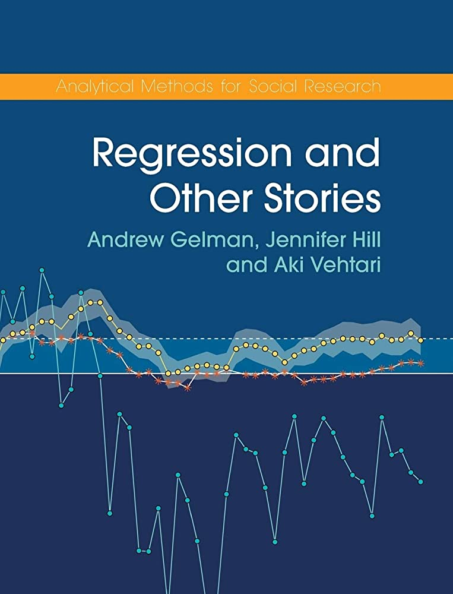

```{r setup, include=FALSE}
knitr::opts_chunk$set(echo = TRUE,
                      eval = TRUE,
                      size = "tiny",
                      message = FALSE,
                      warning = FALSE,
                      fig.align = "center",
                      out.width = "80%")

def.chunk.hook  <- knitr::knit_hooks$get("chunk")
knitr::knit_hooks$set(chunk = function(x, options) {
  x <- def.chunk.hook(x, options)
  ifelse(options$size != "normalsize", paste0("\n \\", options$size,"\n\n", x, "\n\n \\normalsize"), x)
})
```

```{r packages, include=FALSE}
devtools::load_all()
library(tidyverse)
library(kableExtra)
library(patchwork)
library(here)
```

```{r functions, include = FALSE}
funs <- get_funs(here("R", "utils.R"))
```

## Outline

<!-- \tableofcontents[hideallsubsections] -->
\scriptsize
\tableofcontents

# Beyond the Gaussian distribution

## Quick recap about Gaussian distribution

- The Gaussian distribution is part of the Exponential family
- It is defined with mean ($\mu$) and the standard deviation ($\sigma$) that are independent
- It is symmetric with the same value for mean, mode and median
- The support is $[- \infty, + \infty]$

The Probability Density Function (PDF) is:

$$
f(x) = \frac{1}{\sigma\sqrt{2\pi}} e^{-\frac{1}{2}(\frac{x - \mu}{\sigma})^2}
$$

## Quick recap about Gaussian distribution

```{r, echo = FALSE}
ggnorm(0, 1) + 
    mytheme() +
    ggtitle(latex2exp::TeX("$\\mu = 0$, $\\sigma = 1$"))
```

\begin{center}
But not always gaussian-like variables!
\end{center}

## Quick recap about Gaussian distribution

In fact, in Psychology, variables do not always satisfy the properties of the Gaussian distribution. For example:

- Reaction times
- Accuracy
- Percentages or proportions
- Discrete counts
- Likert scales

## Reaction times

Measuring **reaction times during a cognitive task**. Non-negative and probably skewed data.

```{r, echo = FALSE}
dat <- data.frame(
    x = rgamma(1e5, 9, scale = 0.5)*100
) 

dat |> 
    ggplot(aes(x = x)) +
    geom_histogram(fill = "lightblue",
                   color = "black") +
    xlab("Reaction Times (ms)") +
    ylab("Count") +
    mytheme()
```

## Binary outcomes

Counting the number of people passing the exam out of the total. Discrete and non-negative. A series of binary (i.e., *bernoulli*) experiments.

```{r, echo = FALSE}
dat <- data.frame(y = c(70, 30), x = c("Passed", "Failed"))

dat |> 
    ggplot(aes(x = x, y = y)) +
    geom_col(color = "black",
             fill = "lightblue") +
    ylab("%") +
    ylim(c(0, 100)) +
    mytheme() +
    theme(axis.title.x = element_blank()) +
    ggtitle("Statistics Final Exam (n = 100)")
```

## Counts

Counting the number of new hospitalized patients during one month in different cities. Discrete and non-negative values.

```{r, echo = FALSE}
dat <- data.frame(x = rpois(1e5, 15))

dat |> 
    ggplot(aes(x = x)) +
    geom_histogram(binwidth = 2,
                   color = "black",
                   fill = "lightblue") +
    xlab("Number of new patients during one month") +
    ylab("Count") +
    mytheme()
```

## Question...

```{r, results='asis', echo=FALSE}
question("Should we use a linear model for these variables?")
```

## Should we use a linear model for these variables?

Let's try to fit a linear model on the probability of passing the exam as a function of the hours of study:

```{r, echo = FALSE}
# y = number of exercises solved in 1 semester
# x = percentage of attended lectures

n <- 50
x <- round(runif(n, 0, 100))
b0 <- 0.01
b1 <- 0.08
y <- rbinom(length(x), 1, plogis(qlogis(b0) + b1*x))

dat <- data.frame(student = 1:n, study_hours = x, passing = y)

dat |> 
    trim_df() |> 
    mytab()
```

## Should we use a linear model for these variables?

Let's plot the data:

```{r, echo = FALSE}
exam_plot <- dat |>
    ggplot(aes(x = study_hours, y = passing)) +
    geom_hline(yintercept = 0, linetype = "dashed", col = "red") +
    geom_point(size = 3,
               alpha = 0.5,
               position = position_jitter(height = 0.03)) +
    mytheme() +
    xlab("Hours of study") +
    ylab("Passing the exam")
exam_plot
```

## Should we use a linear model for these variables?

Let's fit a linear model `passing ~ study_hours` using `lm`:

```{r, echo = FALSE}
exam_plot +
    geom_smooth(method = "lm", se = F)
```

\begin{center}
Do you see something strange?
\end{center}

## Should we use a linear model for these variables?

A little **spoiler**, the relationship should be probably like this:

```{r, echo = FALSE}
exam_plot +
    stat_smooth(method = "glm", 
                se = FALSE,
                method.args = list(family = binomial))
```

## Should we use a linear model for these variables?

Another example, the number of solved exercises in a semester as a function of the number of attended lectures:

```{r, echo = FALSE}
# y = number of exercises solved in 1 semester
# x = percentage of attended lectures

n <- 100
x <- round(runif(n, 0, 63))
y <- rpois(n, exp(0 + 0.05*x))

dat <- data.frame(student = 1:n, attended_lectures = x, nsolved = y)

dat |> 
    trim_df() |> 
    mytab()
```

## Should we use a linear model for these variables?

```{r, echo = FALSE}
exam_plot <- dat |> 
    ggplot(aes(x = attended_lectures, y = nsolved)) +
    geom_hline(yintercept = 0, linetype = "dashed", col = "red") +
    geom_point(size = 3) +
    mytheme() +
    xlab("Number of attended lectures") +
    ylab("Solved exercises")
exam_plot
```

## Should we use a linear model for these variables?

Again, fitting the linear model seems partially appropriate but there are some problems:

```{r, echo = FALSE}
exam_plot +
    geom_smooth(method = "lm", se = FALSE)
```

## Should we use a linear model for these variables?

Also the residuals are quite problematic:

```{r, echo = FALSE}
fit <- lm(nsolved ~ attended_lectures, data = dat)

dfit <- data.frame(
    fitted = fitted(fit),
    residuals = residuals(fit)
)

qqn <- dfit |> 
    ggplot(aes(sample = residuals)) + 
    stat_qq() + 
    stat_qq_line() +
    xlab("Theoretical Quantiles") +
    ylab("Residuals") +
    mytheme()

res_fit <- dfit |> 
    ggplot(aes(x = fitted, y = residuals)) +
    geom_point() +
    mytheme() +
    ylab("Residuals") +
    xlab("Fitted") +
    geom_smooth(se = FALSE, color = "red")
qqn + res_fit
```

## Should we use a linear model for these variables?

Another little spoiler, the model should consider both the support of the `y` variable and the non linear pattern. Probably something like this:

```{r, echo = FALSE}
exam_plot +
    stat_smooth(method = "glm", 
                se = FALSE,
                method.args = list(family = poisson))
```

## So what?

Both linear models somehow capture the expected relationship but there are serious fitting problems:

- impossible predictions
- poor fitting for non-linear patterns

As a general rule in statistics:

\begin{displayquote}
"All models are wrong, some are useful."

`r tufte::quote_footer('--- George Box')`
\end{displayquote}

## We need a new class of models...

- We need that our model take into account the **features of our response variable**
- We need a model that, **with appropriate transformation**, keep **properties of standard linear models**
- We need a model that is **closer to the true data generation process**

\begin{center}
\textcolor{myblue}{Let's switch to Generalized Linear Models!}
\end{center}

# Generalized Linear Models

## Main references

For a detailed introduction about GLMs

- Chapters: 1 (intro), 4 (GLM fitting), 5 (GLM for binary data)

```{r, echo = FALSE, out.width="30%"}
knitr::include_graphics("img/agresti2015-foundations-lm-glm.jpg")
```

## Main references

For a basic and well written introduction about GLM, especially the Binomial GLM

- Chapters: 3 (intro GLMs), 4-5 (Binomial Logistic Regression)

```{r, echo = FALSE, out.width="50%"}

```

## Main references

Great resource for interpreting Binomial GLM parameters:

- Chapters: 13-14 (Binomial Logistic GLM), 15 (Poisson and others GLMs)
```{r, echo = FALSE, out.width="30%"}

```

## Main references

Detailed GLMs book. Very useful especially for the diagnostic part:

- Chapters: 8 (intro), 9 (Binomial GLM), 10 (Poisson GLM and overdispersion)

```{r, echo = FALSE, out.width="30%"}
knitr::include_graphics("img/dunn2018-glm.jpg")
```

## General idea

- models that assume distributions other than the normal distributions
- models that considers non-linear relationships

## Recipe for a GLM

- **Random Component**
- **Systematic Component**
- **Link Function**

## Random Component

The **random component** of a GLM identify the response variable $Y$ and the appropriate probability distribution. For example for a numerical and continuous variable we could use a Normal distribution (i.e., a standard linear model). For a discrete variable representing counts of events we could use a Poisson distribution, etc.

## Systematic Component

The **systematic component** or *linear predictor* ($\eta$) of a GLM is the combination of explanatory variables i.e. $\beta_0 + \beta_1x_1 + ... + \beta_px_p$.

\begin{align*}
\eta = \beta_0 + \beta_1x_1 + ... + \beta_px_p
\end{align*}

## Link Function

- The **link function** $g(\mu)$ is the function that connects the expected value (i.e., the mean $\mu$) of the probability distribution (i.e., the random component) with the *linear combination* of predictors $g(\mu) = \beta_0 + \beta_1x_1 + ... + \beta_px_p$. The inverse of the link function $g^{-1}$ map the linear predictor ($\eta$) into the original scale.

\begin{align*}
g(\mu) = \beta_0 + \beta_1x_1 + ... + \beta_px_p \\
\mu = g^{-1}(\beta_0 + \beta_1x_1 + ... + \beta_px_p) 
\end{align*}

## Link function

- The simplest **link function** is the **identity link** where $g(\mu) = \mu$ and correspond to the standard linear model. In fact, the linear regression is just a GLM with a **Gaussian random component** and the **identity** link function.

- There are multiple **random components** and **link functions** for example with a 0/1 binary variable the usual choice is using a **Binomial** random component and the **logit** link function.

## Common link functions

```{r, echo = FALSE}
fam <- c("gaussian", "binomial", "binomial", "poisson")
link <- c("identity", "logit", "probit", "log")
range <- c("$(-\\infty,+\\infty)$", "$\\frac{0, 1, ..., n_{i}}{n_{i}}$",
           "$\\frac{0, 1, ..., n_{i}}{n_{i}}$",
           "$0, 1, 2, ...$")

linktab <- data.frame(Family = fam, Link = link, Range = range)
linktab |> mytab()
```

# Relevant distributions

## Binomial distribution

The probability of having $k$ success (e.g., 0, 1, 2, etc.) out of $n$ trials with a probability of success $p$ is:

$$
f(n, k, p) = Pr(X = k) = \binom{n}{k} p^k(1 - p)^{n - k}
$$

The $np$ is the mean of the binomial distribution and $np(1 - p)$ is the variance.

## Bernoulli distribution

The **binomial** distribution is just a repetition of $k$ **Bernoulli** trials. A single Bernoulli trial is:

\begin{align*}
f(x, p) = p^x (1 - p)^{1 - x} \\
x \in \{0, 1\}
\end{align*}

The mean is $p$ and the variance is $p(1 - p)$

## Bernoulli and Binomial

The simplest situation for a Bernoulli trial is a coin flip. In R:

::: columns
:::: column

```{r}
n <- 1
p <- 0.7
rbinom(1, n, p) # a single bernoulli trial

n <- 10
rbinom(1, 10, p) # n bernoulli trials
```

::::
:::: column
```{r, echo = FALSE, out.width="90%"}
n <- 30
p <- 0.7
dat <- data.frame(k = 0:n)
dat$y <- dbinom(dat$k, n, p)

dat |> 
    ggplot(aes(x = k, y = y)) +
    geom_point() +
    geom_segment(aes(x = k, xend = k, y = 0, yend = y)) +
    mytheme() +
    ylab("dbinom(x, n, p)") +
    ggtitle(latex2exp::TeX("$n = 30$, $p = 0.7$"))

```
::::
:::

## Poisson distribution

The number of events $k$ during a fixed time interval (e.g., number of new user on a website in 1 week) is:

\begin{align*}
f(j,\lambda) = Pr(X = k) = \frac{\lambda^k e^{-\lambda}}{k!}
\end{align*}

## Poisson distribution

```{r, echo = FALSE}
lambda <- 10
dat <- data.frame(x = 0:100)
dat$y <- dpois(dat$x, lambda)

dat |> 
    filter(x < 30) |> 
    ggplot(aes(x = x, y = y)) +
    geom_line() +
    geom_point(size = 4, shape = 21, stroke = 3, color = "white",
               fill = "black") +
    mytheme() +
    ylab(latex2exp::TeX("dpois(x, $\\lambda$)")) +
    ggtitle(latex2exp::TeX("$\\lambda = 10$"))
```

The mean and also the variance is $\lambda$.

# Data simulation `#extra`

## Data simulation `#extra`

- During the course we will try to simulate some data. Simulating data is an amazing education tool to understand a statistical model.
- By simulating from a **generative model** we are doing **Monte Carlo Simulations** [@Gentle2009-cj]

## Data simulation `#extra`

::: columns

:::: column
```{r, size = "tiny"}
n <- 1e5 # number of experiments
nt <- 100 # number of subjects
p <- 0.7 # probability of success
nc <- rbinom(n, nt, p)
```

```{r, echo = FALSE}
hist(nc/nt)
```
::::

:::: column
```{r, size = "tiny"}
n <- 1e5 # number of subjects
lambda <- 30 # mean/variance
y <- rpois(n, lambda)
```

```{r, echo = FALSE}
hist(y)
```
::::
:::

## References
