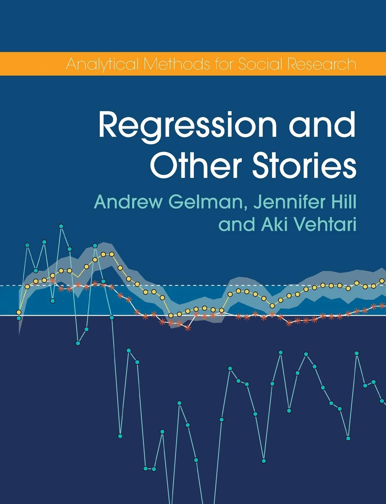

```{r setup, include=FALSE}
knitr::opts_chunk$set(echo = FALSE, 
                      dev = "pdf", 
                      fig.align = "center",
                      out.width = "80%",
                      fig.width = 7,
                      message = FALSE, 
                      warning = FALSE)
```

```{r packages}
library(tidyverse)
library(distributional)
library(ggdist)
library(patchwork)
library(kableExtra)
devtools::load_all()
```

## An example...

We measure the **accuracy** of students to questions of **increasing difficulty**, from 0 = easy to 7 = very hard. Thus we have binary data where 1 = passed and 0 = failed.

```{r, include = TRUE}
difficulty <- rep(0:7, each = 20)
b0 <- qlogis(0.95)
b1 <- -0.7
dat <- data.frame(id = 1:length(difficulty),
                  difficulty)
dat$p <- plogis(b0 + b1*difficulty)
dat$y <- rbinom(nrow(dat), 1, dat$p)
```

```{r}
dat |>
    select(-p) |> 
    trim_df() |> 
    mytab()
```

## An example...

```{r}
dat |> 
    group_by(difficulty) |> 
    summarise(nc = sum(y),
              nf = n() - nc,
              tot = n()) |> 
    ggplot(aes(x = factor(difficulty),
               y = (nc/tot)*100)) +
    geom_col() +
    labs(
        x = "Difficulty",
        y = "% Correct"
    ) + 
    mytheme()
```

## Fitting a linear model

Let's try to fit a regression line as `y ~ accuracy`:

```{r lm-binary-example}
dat |> 
    ggplot(aes(x = difficulty, y = y)) +
    geom_point(position = position_jitter(height = 0.01)) +
    geom_smooth(method = "lm", se = FALSE) +
    ylim(c(0,1))
```

## Fitting a linear model

\begin{columns}
\begin{column}{0.3\textwidth}

```{r}
<<lm-binary-example>>
```

\end{column}
\begin{column}{0.7\textwidth}

\begin{itemize}
    \item It is appropriate?
    \item The model is (more or less) capturing the relationship
    \item As the difficulty increases, the accuracy decreases
\end{itemize}

\end{column}
\end{columns}

## Fitting a linear model

\begin{displayquote}
"All models are wrong, some are useful."

`r tufte::quote_footer('--- George Box')`
\end{displayquote}

- The model is capturing the decreasing relationship! GOOD!
- The model is doing something strange, do you see something strange? 

## Fitting a linear model, problems...

Let's predict some unobserved values:
    
```{r}
fit <- lm(y ~ difficulty, data = dat)
x <- seq(0, 15, 1)
p <- predict(fit, newdata = data.frame(difficulty = x))

pr <- data.frame(x, p)

ggplot() +
    geom_line(data = pr, 
              aes(x = x, y = p),
              col = "blue", linewidth = 1) +
    geom_hline(yintercept = c(0,1),
               linetype = "dashed") +
    geom_point(data = dat, 
               aes(x = difficulty, y = y),
               position = position_jitter(height = 0.02),
               size = 2) +
    xlim(c(0, 12)) +
    labs(x = "Difficulty",
         y = "Probability") +
    mytheme()
```

## Fitting a linear model, problems...

- Impossible predictions, probabilities are bounded between 0 and 1
- If the `x` variable has a wider range, the model is completely wrong
- Despite somehow *useful*, the model is seriously *flawed*

\begin{block}{Block title}
We need a model take take into account our dependent variables. Let's switch to the \textbf{generalized linear models}! 
\end{block}

## Not only binary data...

```{r}
pois <- data.frame(
    y = rpois(1e5, 15)
)

gam <- data.frame(
    y = rgamma(1e5, shape = 9, scale = 0.5) * 100
)

p_pois <- ggplot(pois, aes(x = y)) +
    geom_histogram(bins = 10,
                   fill = "skyblue",
                   color = "black") +
    labs(x = "Errors in a cognitive task",
         y = "Count") +
    mytheme() +
    ggtitle("Poisson distribution")

p_gamma <- ggplot(gam, aes(x = y)) +
    geom_histogram(fill = "skyblue",
                   color = "black") +
    labs(x = "Reaction Times",
         y = "Count") +
    mytheme() +
    ggtitle("Gamma distribution")

p_pois + p_gamma
```

## Why the linear model is not appropriate?

```{r}
x <- rep(seq(0, 12, 3), each = 20)

y <- 0.5 + 0.9*x + rnorm(length(x), 0, 1)

dat <- data.frame(
    y, x
)

datn <- data.frame(
    x = unique(x),
    m = 0,
    s = 1
)

fit <- lm(y ~ x)
datn$m <- predict(fit, newdata = data.frame(x = unique(x)))

datn <- datn |> 
    mutate(norm0 = dist_normal(0, s),
           normlm = dist_normal(m, s))


ggplot() +
stat_halfeye(data = datn, aes(x = x + 0.2, dist = normlm),
             width = 2,
             show_interval = FALSE) +
geom_point(data = dat, aes(x = x - 0.2, y = y),
           position = position_jitter(width = 0.1)) +
    geom_smooth(data = dat, aes(x = x, y = y), method = "lm",
                se = FALSE) +
    mytheme()
```

## Ciao

```{r}
difficulty <- rep(1:25, each = 15)
b0 <- qlogis(0.98)
b1 <- -0.3
dat <- data.frame(id = 1:length(difficulty),
                  difficulty)
dat$p <- plogis(b0 + b1*difficulty)
dat$y <- rbinom(nrow(dat), 1, dat$p)

fit <- glm(y ~ difficulty, data = dat, family = binomial(link = "logit"))

data.frame(difficulty = seq(1, 24, 4)) |> 
    add_predict(fit, se.fit = TRUE, type = "response") |> 
    mutate(dist = dist_normal(fit, se.fit)) |> 
    ggplot(aes(x = difficulty, dist = dist)) +
    stat_halfeye(show_interval = FALSE) +
    geom_point(aes(x = difficulty, y = fit)) +
    mytheme()
```

## Logit and Probability

\begin{columns}
\begin{column}{0.3\textwidth}

The logit transformation map probabilities with range $(0, 1)$ to $(-\infty, \infty)$.

\begin{multiline}
logit(\pi) = log \left( \frac{\pi}{1 - \pi}\right) \\
logit(\pi)^{-1} = \frac{e^{\pi}}{1 + e^{\pi}}
\end{multiline}

\end{column}
\begin{column}{0.7\textwidth}

```{r}
ggplot(data = data.frame(x = c(-Inf, Inf)),
       aes(x = x)) +
    stat_function(fun = plogis, n = 1e4,
                  size = 1) +
    xlim(-5, 5) +
    ylab(latex2exp::TeX("$\\pi$")) +
    xlab(latex2exp::TeX("$log(\\frac{\\pi}{1 - \\pi})$")) +
    mytheme()

```

\end{column}
\end{columns}

## Recipe for a **G**eneralized **L**inear **M**odel

1. A vector of outcome data $y = (y_1,..., y_n)$
2. A matrix of predictors X and vector of coefficients $\beta$, forming a linear predictor vector $X\beta$
3. A link function $g$, yielding a vector of transformed data $\hat y = g^{−1}(X\beta)$ that are used to model the
data

## For example in logistic regression

- The link function $g$ is the **logit** function $logit(\pi) = log \left( \frac{\pi}{1-\pi}\right)$ and the inverse is $logit(\pi)^{-1} = \frac{e^{\pi}}{1 + e^{\pi}}$
- The relationship between $y$ and $x$ is linear on the transformed space (thus applying $g$) but non linear on the original space (thus applying $g^{-1}$).
- In this way, we can reason as in a standard linear model when we are in the transformed space. The drawback is that coming back on the original scale the relationship is no longer linear

## Linear on the $g(x)$ scale but not on the $g^{-1}(x)$ scale

```{r}
x <- runif(10000, 0, 1)
p <- plogis(qlogis(0.01) + 8*x)
linpred <- qlogis(p)
y <- rbinom(length(x), 1, p)

dat <- data.frame(
    y = y,
    x = x,
    p = p,
    lp = linpred
)

fp <- function(x) {
    qlogis(0.01) + 8 * x
}

pp <- c(0.5, 0.6, 0.7, 0.8)

plot_logit <- ggplot() +
    stat_function(data = data.frame(x = c(0,1)), 
                  aes(x),
                  fun = fp) +
    # points
    geom_point(aes(x = pp, y = fp(pp))) +
    geom_point(aes(x = c(0, 0, 0, 0), y = fp(pp))) + 
    geom_point(aes(x = pp, y = c(-5, -5, -5, -5))) +
    # segments
    geom_segment(aes(x = pp, y = c(-5, -5, -5, -5),
                 xend = pp, yend = fp(pp)),
                 linetype = "dashed",
                 linewidth = 0.3) +
    geom_segment(aes(x = pp, y = c(-5, -5, -5, -5),
                     xend = pp, yend = fp(pp)),
                 linetype = "dashed",
                 linewidth = 0.3) +
    geom_segment(aes(x = c(0,0,0,0), y = fp(pp),
                     xend = pp, yend = fp(pp)),
                 linetype = "dashed",
                 linewidth = 0.3) +
    mytheme() +
    xlab("x") +
    ylab(latex2exp::TeX("$logit(\\pi)$"))

plot_invlogit <- ggplot() +
    stat_function(data = data.frame(x = c(0,1)), 
                  aes(x),
                  fun = function(x) plogis(fp(x))) +
    # points
    geom_point(aes(x = pp, y = plogis(fp(pp)))) +
    geom_point(aes(x = pp, y = c(0, 0, 0, 0))) +
    geom_point(aes(x = c(0, 0, 0, 0), y = plogis(fp(pp)))) +
    # segments
    geom_segment(aes(x = pp, y = c(0, 0, 0, 0),
                     xend = pp, yend = plogis(fp(pp))),
                 linetype = "dashed",
                 linewidth = 0.3) +
    geom_segment(aes(x = pp, y = c(0, 0, 0, 0),
                     xend = pp, yend = plogis(fp(pp))),
                 linetype = "dashed",
                 linewidth = 0.3) +
    geom_segment(aes(x = c(0, 0, 0, 0), y = plogis(fp(pp)),
                     xend = pp, yend = plogis(fp(pp))),
                 linetype = "dashed",
                 linewidth = 0.3) +
    mytheme() +
    xlab("x") +
    ylab(latex2exp::TeX("$logit^{-1}(\\pi)$"))

plot_logit | plot_invlogit
```

# Suggested Materials

## Regression and other stories^[Gelman, Hill and Vehtari (2020). The book is freely available online at https://avehtari.github.io/ROS-Examples/]

```{r}

```

# Interpreting coefficients

## Predicting Probability at a fixed $x$ level

Given the non-linearity we need to choose **where to evaluate** changes on the probability scale. With a simple logistic regression $y \sim x$ we can find the probability value associated with a fixed level of $x$ using $p(y|x) = \beta_0 + \beta_1x_i$:

```{r}
dat <- data.frame(x = rep(seq(0, 1, 0.05), each = 1000)) |> 
    sim_binomial(b0 = 0.01, b1 = 8, link = "logit", data = _)

fit <- glm(y ~ x, data = dat, family = binomial(link = "logit"))

title <- sprintf("$logit^{-1}(\\beta_0 + \\beta_1 0.55) = %.3f$", 
                 plogis(coef(fit)[1] + coef(fit)[2]*0.55))
dat |> 
    ggplot() +
    geom_line(aes(x = x, y = p)) + 
    geom_point(x = 0.55, y = plogis(coef(fit)[1] + coef(fit)[2]*0.55)) +
    geom_segment(x = 0.55, y = 0,
                 xend = 0.55, yend = plogis(coef(fit)[1] + coef(fit)[2]*0.55),
                 linewidth = 0.1) +
    geom_segment(x = 0.55, y = plogis(coef(fit)[1] + coef(fit)[2]*0.55),
                 xend = 0, yend = plogis(coef(fit)[1] + coef(fit)[2]*0.55),
                 linewidth = 0.1) +
    mytheme() +
    ggtitle(latex2exp::TeX(title))
```

## The divide by 4 rule

The logistic curve is steepest at its center, at which point α + βx = 0 so that logit−1(α + βx) = 0.5;
see Figure 13.1. The slope of the curve—the derivative of the logistic function—is maximized at this
point and attains the value βe0/(1 + e0)2 = β/4. Thus, β/4 is the maximum difference in Pr(y = 1)
corresponding to a unit difference in x.
As a rule of convenience, we can take logistic regression coefficients (other than the constant
term) and divide them by 4 to get an upper bound of the predictive difference corresponding to a unit
difference in x. This upper bound is a reasonable approximation near the midpoint of the logistic
curve, where probabilities are close to 0.5.

## Odds ratios

This clearly shows how odds ratio are mapped into the coefficients and they are stable for every unit increase:

```{r}
dat <- data.frame(x = runif(1000, 0, 10)) |> 
    sim_binomial(0.01, 0.8, "logit", data = _)

fit <- glm(y ~ x, data = dat, family = binomial(link = "logit"))

pr <- predict(fit, data.frame(x = c(5, 6, 7)), type = "response")

odds_ratio(pr[2], pr[1]) # 2 vs 1
odds_ratio(pr[3], pr[2]) # 3 vs 2
exp(coef(fit)[2])
```

## Coefficient estimates and standard errors

When fitting the model we have the parameter estimate and the standard error. The standard error is the standard deviation of the sampling distribution.

- values within $\beta \pm 2SE$ can be considered as consistent with the data
- if the null value (e.g., 0) is not contained in the interval $\beta \pm 2SE$ we could consider it as statistically significant. To note, using the $\beta \pm zSE$ where $z = \Phi^{-1}(\frac{\alpha}{2})$ we obtain the 95% confidence interval and a two-tail test on the $\beta$ parameter.

## Coefficient estimates and standard errors

```{r}
dat <- data.frame(x = runif(100, 0, 10)) |> 
    sim_binomial(0.01, 0.8, "logit", data = _)

fit <- glm(y ~ x, data = dat, family = binomial(link = "logit"))
params <- broom::tidy(fit, conf.int = TRUE)

plot_param(fit, "x") + mytheme()
```

## Confidence intervals with the $g(x)^{-1}$

When coming back on the original (probability) scale we have to compute the confidence intervals on the correct scale. In particular:

```{r}
dat <- data.frame(x = runif(100, 0, 10)) |> 
    sim_binomial(0.01, 0.8, "logit", data = _)

fit <- glm(y ~ x, data = dat, family = binomial(link = "logit"))

# logit scale
pr <- predict(fit, data.frame(x = 5), se.fit = TRUE)
pr

# probability scale
c(
    plogis(pr$fit + pr$se.fit * qnorm(0.025)),
    plogis(pr$fit - pr$se.fit * qnorm(0.025))
)
```

## Confidence intervals with the $g(x)^{-1}$

Standard error of a proportion:

$$
SE_{\hat p} = \sqrt{\frac{\hat p (1 - \hat p)}{n}}
$$

Standard error of a proportion of 0 or 1:

$$
\hat p = \frac{y + 2}{n + 4} \\
SE_{\hat p} = \sqrt{\frac{\hat p (1 - \hat p)}{n + 4}}
$$

## Probit vs logit

- main differences
- what to choose (maybe SDT and psychophysics)

## Average Predictive difference

Gelman, pp. 251

The idea is to keep all parameters as nousiance parameters, and fix the levels to compare. Compute the probabilities at each combination, make the difference and take the average difference.

On average, the two conditions differs, keeping other levels the same <!-- TODO why not fixed -->

```{r}
data("wells")

wells$dist100 <- wells$dist/100

fit <- glm(switch ~ dist100 + arsenic + educ, data = wells, family = binomial(link = "logit"))

b <- coef(fit)

delta <- invlogit(b[1] + b[2] * 0 + b[3]*wells$arsenic + b[4]*wells$educ) -
         invlogit(b[1] + b[2] * 1 + b[3]*wells$arsenic + b[4]*wells$educ)

mean(delta)
```

